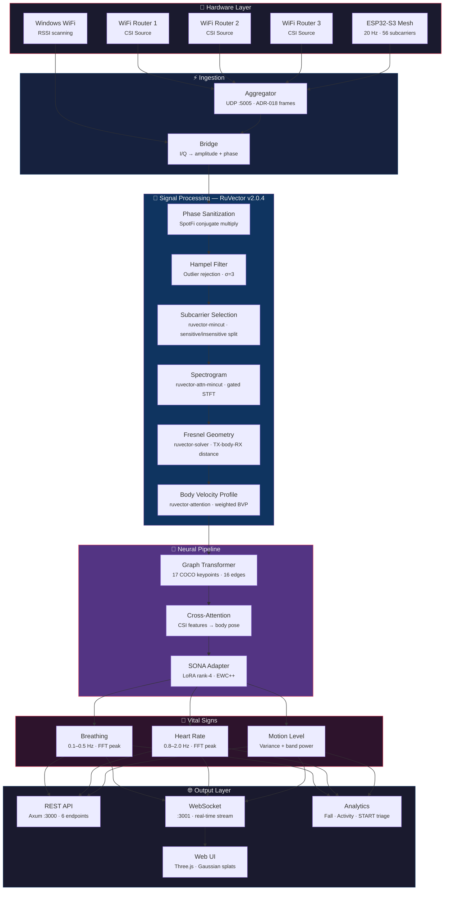
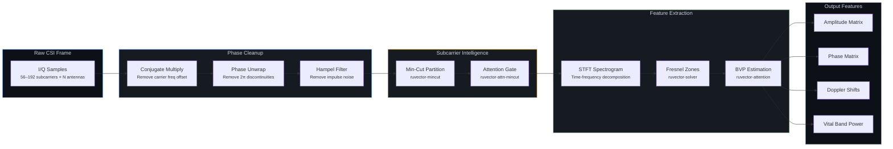
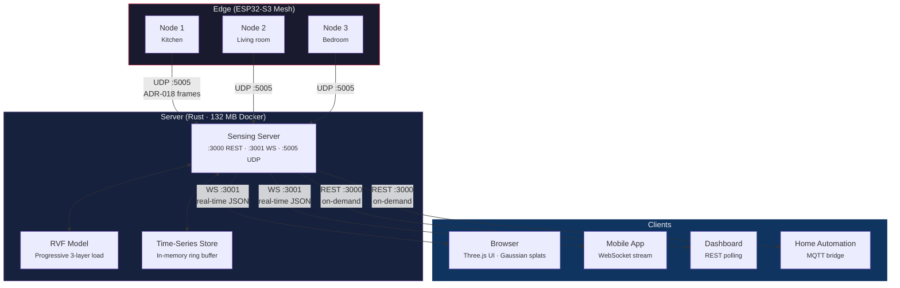

# 🌐 RuView

<p align="center">
  <a href="https://ruvnet.github.io/RuView/">
    
  </a>
</p>

## **Nhìn xuyên tường bằng WiFi + AI** ##

**Cảm nhận thế giới qua tín hiệu.** Không camera. Không thiết bị đeo. Không Internet. Chỉ là vật lý.

### 🌐 RuView là hệ thống nhận thức AI edge học trực tiếp từ môi trường xung quanh.

Thay vì dựa vào camera hay mô hình đám mây, nó quan sát bất kỳ tín hiệu nào tồn tại trong không gian như WiFi, sóng radio trên phổ, các mẫu chuyển động, rung động, âm thanh, hoặc các đầu vào cảm biến khác và xây dựng hiểu biết về những gì đang xảy ra cục bộ.

Được xây dựng trên nền tảng [RuVector](https://github.com/ruvnet/ruvector/), dự án trở nên được biết đến rộng rãi nhờ triển khai WiFi DensePose — một kỹ thuật sensing được khám phá lần đầu trong nghiên cứu học thuật như công trình *DensePose From WiFi* của Carnegie Mellon University. Nghiên cứu đó đã chứng minh rằng tín hiệu WiFi có thể được dùng để tái tạo tư thế người.

RuView mở rộng khái niệm đó thành một hệ thống edge thực tế. Bằng cách phân tích các nhiễu loạn Channel State Information (CSI) do chuyển động người gây ra, RuView tái tạo vị trí cơ thể, nhịp thở, nhịp tim, và sự hiện diện theo thời gian thực bằng cách sử dụng xử lý tín hiệu dựa trên vật lý và machine learning.

Không giống như các hệ thống nghiên cứu dựa vào camera đồng bộ để huấn luyện, RuView được thiết kế để hoạt động hoàn toàn từ tín hiệu radio và self-learned embeddings tại edge.

Hệ thống chạy hoàn toàn trên phần cứng giá rẻ như ESP32 sensor mesh (~$1 mỗi node). Các module edge lập trình nhỏ phân tích tín hiệu cục bộ và học RF signature của phòng theo thời gian, cho phép hệ thống tách biệt môi trường khỏi hoạt động xảy ra bên trong.

Vì RuView học gần với tín hiệu nó quan sát, nó cải thiện khi hoạt động. Mỗi triển khai phát triển một mô hình cục bộ về môi trường xung quanh và liên tục thích nghi mà không cần camera, dữ liệu được gán nhãn, hay cơ sở hạ tầng đám mây.

Trong thực tế điều này có nghĩa là các môi trường thông thường có được một loại nhận thức không gian mới. Phòng, tòa nhà, và thiết bị bắt đầu cảm nhận sự hiện diện, chuyển động, và hoạt động vital bằng cách sử dụng các tín hiệu đã lấp đầy không gian.

### Được xây dựng cho các ứng dụng edge tiêu thụ điện thấp

Các [edge modules](#edge-intelligence-adr-041) là các chương trình nhỏ chạy trực tiếp trên ESP32 sensor — không cần internet, không phí đám mây, phản hồi tức thì.

[](https://www.rust-lang.org/)
[](https://opensource.org/licenses/MIT)
[](https://github.com/ruvnet/RuView)
[](https://hub.docker.com/r/ruvnet/wifi-densepose)
[](#vital-sign-detection)
[](#esp32-s3-hardware-pipeline)
[](https://crates.io/crates/wifi-densepose-ruvector)

 
> | Tính năng | Phương pháp | Tốc độ |
> |------|-----|-------|
> | **Pose estimation** | Biên độ/pha subcarrier CSI → DensePose UV maps | 54K fps (Rust) |
> | **Phát hiện nhịp thở** | Bandpass 0.1-0.5 Hz → đỉnh FFT | 6-30 BPM |
> | **Nhịp tim** | Bandpass 0.8-2.0 Hz → đỉnh FFT | 40-120 BPM |
> | **Sensing hiện diện** | Phương sai RSSI + công suất dải chuyển động | Độ trễ < 1ms |
> | **Xuyên tường** | Hình học vùng Fresnel + mô hình multipath | Sâu đến 5m |

```bash
# 30 giây đến live sensing — không cần toolchain
docker pull ruvnet/wifi-densepose:latest
docker run -p 3000:3000 ruvnet/wifi-densepose:latest
# Mở http://localhost:3000
```

> [!NOTE]
> **Cần phần cứng có khả năng CSI.** Pose estimation, vital signs, và sensing xuyên tường dựa vào Channel State Information (CSI) — dữ liệu biên độ và pha từng subcarrier mà WiFi tiêu dùng chuẩn không cung cấp. Bạn cần phần cứng có khả năng CSI (ESP32-S3 hoặc NIC nghiên cứu) để có đầy đủ chức năng. Laptop WiFi tiêu dùng chỉ có thể cung cấp phát hiện hiện diện dựa trên RSSI, kém khả năng hơn đáng kể.

> **Các tùy chọn phần cứng** để thu CSI trực tiếp:
>
> | Lựa chọn | Phần cứng | Chi phí | CSI đầy đủ | Khả năng |
> |--------|----------|------|----------|-------------|
> | **ESP32 Mesh** (khuyến nghị) | 3-6x ESP32-S3 + WiFi router | ~$54 | Có | Pose, nhịp thở, nhịp tim, chuyển động, hiện diện |
> | **Research NIC** | Intel 5300 / Atheros AR9580 | ~$50-100 | Có | CSI đầy đủ với 3x3 MIMO |
> | **WiFi bất kỳ** | Laptop Windows, macOS, hay Linux | $0 | Không | Chỉ RSSI: hiện diện và chuyển động thô |
>
> Không có phần cứng? Xác minh pipeline xử lý tín hiệu với tín hiệu tham chiếu tất định: `python v1/data/proof/verify.py`
>
---

## 📖 Tài Liệu

| Tài liệu | Mô tả |
|----------|-------------|
| [Hướng Dẫn Người Dùng](docs/user-guide.md) | Hướng dẫn từng bước: cài đặt, chạy lần đầu, sử dụng API, thiết lập phần cứng, huấn luyện |
| [Hướng Dẫn Build](docs/build-guide.md) | Build từ source (Rust và Python) |
| [Các Quyết Định Kiến Trúc](docs/adr/README.md) | 48 ADRs — lý do cho mỗi lựa chọn kỹ thuật, được tổ chức theo domain (hardware, xử lý tín hiệu, ML, nền tảng, cơ sở hạ tầng) |
| [Mô Hình Domain](docs/ddd/README.md) | 7 mô hình DDD (RuvSense, Xử lý Tín hiệu, Pipeline Huấn luyện, Nền tảng Phần cứng, Sensing Server, WiFi-Mat, CHCI) — bounded contexts, aggregates, domain events, và ngôn ngữ ubiquitous |
| [Desktop App](rust-port/wifi-densepose-rs/crates/wifi-densepose-desktop/README.md) | **WIP** — Ứng dụng desktop Tauri v2 để quản lý node, cập nhật OTA, triển khai WASM, và trực quan hóa mesh |

---


  <a href="https://ruvnet.github.io/RuView/">
    
  </a>
  <br>
  <em>Skeleton tư thế thời gian thực từ tín hiệu WiFi CSI — không camera, không thiết bị đeo</em>
  <br>
  <a href="https://ruvnet.github.io/RuView/"><strong>▶ Demo Observatory Trực Tiếp</strong></a>

> [Server](#-quick-start) là tùy chọn để trực quan hóa và tổng hợp — ESP32 [chạy độc lập](#esp32-s3-hardware-pipeline) để phát hiện hiện diện, vital signs, và cảnh báo té ngã.


## 🚀 Tính Năng Chính

### Sensing

Nhìn thấy người, nhịp thở, và nhịp tim xuyên tường — chỉ sử dụng tín hiệu WiFi đã có trong phòng.

| | Tính năng | Ý nghĩa |
|---|---------|---------------|
| 🔒 | **Ưu tiên Quyền riêng tư** | Theo dõi tư thế người chỉ sử dụng tín hiệu WiFi — không camera, không video, không lưu hình ảnh |
| 💓 | **Vital Signs** | Phát hiện nhịp thở (6-30 nhịp/phút) và nhịp tim (40-120 bpm) mà không cần thiết bị đeo |
| 👥 | **Đa người** | Theo dõi nhiều người cùng lúc, mỗi người có tư thế và vitals độc lập — không có giới hạn phần mềm cứng (vật lý: ~3-5 người mỗi AP với 56 subcarriers, nhiều hơn với multi-AP) |
| 🧱 | **Xuyên tường** | WiFi đi qua tường, đồ nội thất, và mảnh vỡ — hoạt động ở nơi camera không thể |
| 🚑 | **Ứng phó Thảm họa** | Phát hiện người sống sót bị mắc kẹt qua đống đổ nát và phân loại mức độ thương tích (phân loại START) |
| 📡 | **Multistatic Mesh** | 4-6 sensor node giá rẻ hoạt động cùng nhau, kết hợp 12+ đường tín hiệu chồng chéo để phủ sóng phòng 360 độ với độ chính xác dưới inch và không nhầm lẫn người ([ADR-029](docs/adr/ADR-029-ruvsense-multistatic-sensing-mode.md)) |
| 🌐 | **Mô Hình Field Liên Tục** | Hệ thống học RF signature của mỗi phòng — sau đó trừ phòng để cô lập chuyển động người, phát hiện drift qua nhiều ngày, dự đoán ý định trước khi chuyển động bắt đầu, và gắn cờ các nỗ lực giả mạo ([ADR-030](docs/adr/ADR-030-ruvsense-persistent-field-model.md)) |

### Trí tuệ

Hệ thống tự học và ngày càng thông minh hơn theo thời gian — không cần tinh chỉnh thủ công, không cần dữ liệu được gán nhãn.

| | Tính năng | Ý nghĩa |
|---|---------|---------------|
| 🧠 | **Tự Học** | Tự dạy từ dữ liệu WiFi thô — không cần tập huấn luyện được gán nhãn, không cần camera để khởi động ([ADR-024](docs/adr/ADR-024-contrastive-csi-embedding-model.md)) |
| 🎯 | **Xử Lý Tín Hiệu AI** | Mạng attention, thuật toán đồ thị, và nén thông minh thay thế ngưỡng được tinh chỉnh thủ công — tự động thích nghi với mỗi phòng ([RuVector](https://github.com/ruvnet/ruvector)) |
| 🌍 | **Hoạt Động Ở Mọi Nơi** | Huấn luyện một lần, triển khai ở bất kỳ phòng nào — tổng quát hóa domain đối kháng loại bỏ bias môi trường để các mô hình chuyển đổi qua các phòng, tòa nhà, và phần cứng ([ADR-027](docs/adr/ADR-027-cross-environment-domain-generalization.md)) |
| 👁️ | **Cross-Viewpoint Fusion** | AI kết hợp những gì mỗi sensor nhìn thấy từ góc độ của nó — lấp đầy điểm mù và sự mơ hồ chiều sâu mà không có góc nhìn đơn nào có thể giải quyết ([ADR-031](docs/adr/ADR-031-ruview-sensing-first-rf-mode.md)) |
| 🔮 | **Giao Thức Signal-Line** | Pipeline xử lý 6 giai đoạn biến đổi tín hiệu WiFi thô thành biểu diễn cơ thể có cấu trúc — từ làm sạch tín hiệu qua lý luận không gian dựa trên đồ thị đến đầu ra pose cuối cùng ([ADR-033](docs/adr/ADR-033-crv-signal-line-sensing-integration.md)) |
| 🔒 | **Bảo Mật QUIC Mesh** | Tất cả giao tiếp sensor-to-sensor được mã hóa end-to-end với phát hiện giả mạo, bảo vệ replay, và kết nối lại liền mạch nếu node di chuyển hoặc ngoại tuyến ([ADR-032](docs/adr/ADR-032-multistatic-mesh-security-hardening.md)) |
| 🎯 | **Bộ Phân Loại Thích Nghi** | Ghi lại các phiên CSI được gán nhãn, huấn luyện mô hình logistic regression 15 đặc trưng trong Rust thuần, và học các đặc điểm tín hiệu độc đáo của phòng — thay thế ngưỡng được tinh chỉnh thủ công bằng phân loại dữ liệu ([ADR-048](docs/adr/ADR-048-adaptive-csi-classifier.md)) |

### Hiệu Suất & Triển Khai

Đủ nhanh để sử dụng thời gian thực, đủ nhỏ cho thiết bị edge, đủ đơn giản để thiết lập một lệnh.

| | Tính năng | Ý nghĩa |
|---|---------|---------------|
| ⚡ | **Thời Gian Thực** | Phân tích tín hiệu WiFi trong dưới 100 microseconds mỗi frame — đủ nhanh để giám sát trực tiếp |
| 🦀 | **Nhanh Hơn 810x** | Rust rewrite hoàn chỉnh: pipeline 54.000 frames/giây, Docker image đa kiến trúc, 1.031+ tests |
| 🐳 | **Thiết Lập Một Lệnh** | `docker pull ruvnet/wifi-densepose:latest` — live sensing trong 30 giây, không cần toolchain (amd64 + arm64 / Apple Silicon) |
| 📡 | **Hoàn Toàn Cục Bộ** | Chạy hoàn toàn trên ESP32 $9 — không kết nối internet, không tài khoản đám mây, không phí định kỳ. Phát hiện hiện diện, vital signs, và té ngã trên thiết bị với phản hồi tức thì |
| 📦 | **Mô Hình Di Động** | Các mô hình được huấn luyện đóng gói vào file `.rvf` duy nhất — chạy trên edge, cloud, hay trình duyệt (WASM) |
| 🔭 | **Trực Quan Hóa Observatory** | Dashboard Three.js điện ảnh với 5 bảng holographic — subcarrier manifold, vital signs oracle, heatmap hiện diện, phase constellation, convergence engine — tất cả được điều khiển bởi dữ liệu CSI trực tiếp hoặc demo ([ADR-047](docs/adr/ADR-047-psychohistory-observatory-visualization.md)) |
| 📟 | **Màn Hình AMOLED** | Các bo mạch ESP32-S3 với màn hình AMOLED tích hợp hiển thị hiện diện, vital signs, và trạng thái phòng thời gian thực trực tiếp trên sensor — không cần điện thoại hay PC ([ADR-045](docs/adr/ADR-045-amoled-display-support.md)) |

---

## 🔬 Cách Hoạt Động

Các router WiFi phủ sóng mỗi phòng với sóng radio. Khi một người di chuyển — hay thậm chí thở — những sóng đó tán xạ khác đi. WiFi DensePose đọc mẫu tán xạ đó và tái tạo những gì đã xảy ra:

```
WiFi Router → sóng radio đi qua phòng → chạm vào cơ thể người → tán xạ
    ↓
ESP32 mesh (4-6 nodes) thu CSI trên kênh 1/6/11 qua giao thức TDM
    ↓
Hợp Nhất Đa Băng Tần: 3 kênh × 56 subcarriers = 168 subcarrier ảo mỗi liên kết
    ↓
Hợp Nhất Multistatic: N×(N-1) liên kết → embedding cross-viewpoint có trọng số attention
    ↓
Coherence Gate: chấp nhận/từ chối đo lường → ổn định trong nhiều ngày mà không cần điều chỉnh
    ↓
Xử Lý Tín Hiệu: Hampel, SpotFi, Fresnel, BVP, spectrogram → đặc trưng sạch
    ↓
AI Backbone (RuVector): attention, thuật toán đồ thị, nén, mô hình field
    ↓
Giao Thức Signal-Line (CRV): 6 giai đoạn gestalt → sensory → topology → coherence → search → model
    ↓
Neural Network: tín hiệu đã xử lý → 17 body keypoints + vital signs + mô hình phòng
    ↓
Đầu ra: pose thời gian thực, nhịp thở, nhịp tim, fingerprint phòng, cảnh báo drift
```

Không cần camera huấn luyện — [hệ thống Tự Học (ADR-024)](docs/adr/ADR-024-contrastive-csi-embedding-model.md) khởi động từ dữ liệu WiFi thô một mình. [MERIDIAN (ADR-027)](docs/adr/ADR-027-cross-environment-domain-generalization.md) đảm bảo mô hình hoạt động trong bất kỳ phòng nào, không chỉ phòng nó được huấn luyện.

---

## 🏢 Trường Hợp Sử Dụng & Ứng Dụng

WiFi sensing hoạt động ở bất cứ đâu có WiFi. Không cần phần cứng mới trong hầu hết các trường hợp — chỉ cần phần mềm trên các access point hiện có hoặc thiết bị bổ sung ESP32 $8. Vì không có camera, các triển khai tránh các quy định quyền riêng tư (video GDPR, hình ảnh HIPAA) theo thiết kế.

**Quy mô:** Mỗi AP phân biệt ~3-5 người (56 subcarriers). Đa AP nhân tuyến tính — lưới bán lẻ 4-AP bao phủ ~15-20 người. Không có giới hạn phần mềm cứng; trần thực tế là vật lý tín hiệu.

| | Tại sao WiFi sensing chiến thắng | Phương án truyền thống |
|---|----------------------|----------------------|
| 🔒 | **Không video, không quy tắc hình ảnh GDPR/HIPAA** | Camera cần sự đồng ý, biển báo, chính sách lưu trữ dữ liệu |
| 🧱 | **Hoạt động xuyên tường, kệ hàng, mảnh vỡ** | Camera cần tầm nhìn trực tiếp mỗi phòng |
| 🌙 | **Hoạt động trong bóng tối hoàn toàn** | Camera cần IR hoặc ánh sáng khả kiến |
| 💰 | **$0-$8 mỗi vùng** (WiFi hiện có hoặc ESP32) | Hệ thống camera: $200-$2.000 mỗi vùng |
| 🔌 | **WiFi đã được triển khai khắp nơi** | Sensor PIR/radar cần đi dây mới mỗi phòng |

<details>
<summary><strong>🏥 Hàng ngày</strong> — Chăm sóc sức khỏe, bán lẻ, văn phòng, khách sạn (WiFi thông thường)</summary>

| Trường hợp sử dụng | Tính năng | Phần cứng | Chỉ số chính | Edge Module |
|----------|-------------|----------|------------|-------------|
| **Chăm sóc người cao tuổi / hỗ trợ sinh hoạt** | Phát hiện té ngã, giám sát hoạt động ban đêm, nhịp thở khi ngủ — không cần tuân thủ thiết bị đeo | 1 ESP32-S3 mỗi phòng ($8) | Cảnh báo té ngã <2s | [Sleep Apnea](docs/edge-modules/medical.md), [Gait Analysis](docs/edge-modules/medical.md) |
| **Giám sát bệnh nhân bệnh viện** | Nhịp thở + nhịp tim liên tục cho giường không quan trọng mà không cần sensor có dây; cảnh báo y tá khi có bất thường | 1-2 AP mỗi phòng bệnh | Nhịp thở: 6-30 BPM | [Respiratory Distress](docs/edge-modules/medical.md), [Cardiac Arrhythmia](docs/edge-modules/medical.md) |
| **Phân loại phòng cấp cứu** | Đếm số người tự động + ước tính thời gian chờ; phát hiện đau khổ của bệnh nhân (nhịp thở bất thường) trong khu vực chờ | WiFi bệnh viện hiện có | Độ chính xác số người >95% | [Queue Length](docs/edge-modules/retail.md), [Panic Motion](docs/edge-modules/security.md) |
| **Số lượng người & luồng bán lẻ** | Lưu lượng khách hàng thời gian thực, thời gian dừng theo vùng, độ dài hàng chờ — không camera, không opt-in, thân thiện GDPR | WiFi cửa hàng hiện có + 1 ESP32 | Độ phân giải dừng ~1m | [Customer Flow](docs/edge-modules/retail.md), [Dwell Heatmap](docs/edge-modules/retail.md) |
| **Sử dụng không gian văn phòng** | Bàn/phòng nào thực sự được chiếm dụng, phòng họp vắng chủ, tối ưu hóa HVAC dựa trên hiện diện thực | WiFi doanh nghiệp hiện có | Độ trễ hiện diện <1s | [Meeting Room](docs/edge-modules/building.md), [HVAC Presence](docs/edge-modules/building.md) |
| **Khách sạn & dịch vụ lưu trú** | Số phòng bị chiếm mà không cần sensor cửa, mẫu sử dụng minibar/phòng tắm, tiết kiệm năng lượng cho phòng trống | WiFi khách sạn hiện có | Tiết kiệm HVAC 15-30% | [Energy Audit](docs/edge-modules/building.md), [Lighting Zones](docs/edge-modules/building.md) |
| **Nhà hàng & dịch vụ thực phẩm** | Theo dõi vòng quay bàn, hiện diện nhân viên bếp, màn hình số phòng vệ sinh bị chiếm — không camera trong khu vực ăn uống | WiFi hiện có | Thời gian chờ hàng ±30s | [Table Turnover](docs/edge-modules/retail.md), [Queue Length](docs/edge-modules/retail.md) |
| **Bãi đậu xe** | Hiện diện người đi bộ trong cầu thang và thang máy nơi camera có điểm mù; cảnh báo bảo mật nếu ai đó nán lại | WiFi hiện có | Xuyên tường bê tông | [Loitering](docs/edge-modules/security.md), [Elevator Count](docs/edge-modules/building.md) |

</details>

<details>
<summary><strong>🏟️ Chuyên biệt</strong> — Sự kiện, thể dục, giáo dục, dân sự (phần cứng có khả năng CSI)</summary>

| Trường hợp sử dụng | Tính năng | Phần cứng | Chỉ số chính | Edge Module |
|----------|-------------|----------|------------|-------------|
| **Tự động hóa nhà thông minh** | Kích hoạt hiện diện cấp phòng (đèn, HVAC, âm nhạc) hoạt động xuyên tường — không có vùng chết, không timeout sensor chuyển động | 2-3 node ESP32-S3 ($24) | Phạm vi xuyên tường ~5m | [HVAC Presence](docs/edge-modules/building.md), [Lighting Zones](docs/edge-modules/building.md) |
| **Thể dục & thể thao** | Đếm rep, sửa tư thế, nhịp thở khi tập — không thiết bị đeo, không camera trong phòng thay đồ | 3+ ESP32-S3 mesh | Pose: 17 keypoints | [Breathing Sync](docs/edge-modules/exotic.md), [Gait Analysis](docs/edge-modules/medical.md) |
| **Trẻ em & trường học** | Giám sát nhịp thở giờ ngủ trưa, đếm đầu người sân chơi, cảnh báo khu vực hạn chế — an toàn quyền riêng tư cho trẻ em | 2-4 ESP32-S3 mỗi vùng | Nhịp thở: ±1 BPM | [Sleep Apnea](docs/edge-modules/medical.md), [Perimeter Breach](docs/edge-modules/security.md) |
| **Địa điểm sự kiện & hòa nhạc** | Lập bản đồ mật độ đám đông, phát hiện nguy cơ chèn ép qua nén nhịp thở, theo dõi luồng sơ tán khẩn cấp | Multi-AP mesh (4-8 APs) | Mật độ mỗi m² | [Customer Flow](docs/edge-modules/retail.md), [Panic Motion](docs/edge-modules/security.md) |
| **Sân vận động & nhà thi đấu** | Số người theo khu vực để định giá động, bố trí nhân viên quầy bán hàng, mô hình luồng thoát khẩn cấp | Lưới AP doanh nghiệp | 15-20 mỗi AP mesh | [Dwell Heatmap](docs/edge-modules/retail.md), [Queue Length](docs/edge-modules/retail.md) |
| **Nhà thờ & nơi thờ phụng** | Đếm người tham dự không cần nhận diện khuôn mặt — hội chúng nhạy cảm quyền riêng tư, theo dõi khuôn viên đa phòng | WiFi hiện có | Độ chính xác cấp vùng | [Elevator Count](docs/edge-modules/building.md), [Energy Audit](docs/edge-modules/building.md) |
| **Kho bãi & hậu cần** | Vùng an toàn công nhân, cảnh báo xe nâng gần, số người trong khu vực nguy hiểm — hoạt động qua kệ và pallet | AP công nghiệp mỗi vùng | Độ trễ cảnh báo <500ms | [Forklift Proximity](docs/edge-modules/industrial.md), [Confined Space](docs/edge-modules/industrial.md) |
| **Cơ sở hạ tầng dân sự** | Số người nhà vệ sinh công cộng (không thể dùng camera), đám đông sân ga tàu điện ngầm, đếm người trú ẩn khi khẩn cấp | WiFi đô thị + ESP32 | Đếm đầu người thời gian thực | [Customer Flow](docs/edge-modules/retail.md), [Loitering](docs/edge-modules/security.md) |
| **Bảo tàng & phòng trưng bày** | Heatmap luồng khách tham quan, thời gian dừng tại triển lãm, cảnh báo điểm nghẽn đám đông — không camera gần tác phẩm (nguy cơ đèn flash/trộm) | WiFi hiện có | Dừng vùng ±5s | [Dwell Heatmap](docs/edge-modules/retail.md), [Shelf Engagement](docs/edge-modules/retail.md) |

</details>

<details>
<summary><strong>🤖 Robotics & Công nghiệp</strong> — Hệ thống tự trị, sản xuất, nhận thức không gian android</summary>

WiFi sensing cung cấp cho robot và hệ thống tự trị một tầng nhận thức không gian hoạt động ở nơi LIDAR và camera thất bại — qua bụi, khói, sương mù, và quanh góc khuất. Trường tín hiệu CSI hoạt động như "giác quan thứ sáu" để phát hiện người trong môi trường mà không cần tầm nhìn trực tiếp.

| Trường hợp sử dụng | Tính năng | Phần cứng | Chỉ số chính | Edge Module |
|----------|-------------|----------|------------|-------------|
| **Vùng an toàn cobot** | Phát hiện sự hiện diện người gần robot cộng tác — tự động giảm tốc hoặc dừng trước khi tiếp xúc, ngay cả sau chướng ngại vật | 2-3 ESP32-S3 mỗi ô | Độ trễ hiện diện <100ms | [Forklift Proximity](docs/edge-modules/industrial.md), [Perimeter Breach](docs/edge-modules/security.md) |
| **Điều hướng AMR kho bãi** | Robot di động tự trị cảm nhận người quanh góc khuất, qua kệ hàng — không có occlusion LIDAR | ESP32 mesh dọc lối đi | Phát hiện xuyên kệ | [Forklift Proximity](docs/edge-modules/industrial.md), [Loitering](docs/edge-modules/security.md) |
| **Nhận thức không gian android / humanoid** | Sensing tư thế người xung quanh cho robot xã hội — phát hiện cử chỉ, hướng tiếp cận, và không gian cá nhân mà không cần camera luôn bật | Module ESP32-S3 trên bo | Pose 17 keypoint | [Gesture Language](docs/edge-modules/exotic.md), [Emotion Detection](docs/edge-modules/exotic.md) |
| **Giám sát dây chuyền sản xuất** | Hiện diện công nhân tại mỗi trạm, cảnh báo tư thế ergonomic, đếm đầu người để tuân thủ ca — hoạt động qua thiết bị | AP công nghiệp mỗi vùng | Pose + nhịp thở | [Confined Space](docs/edge-modules/industrial.md), [Gait Analysis](docs/edge-modules/medical.md) |
| **An toàn công trường xây dựng** | Thực thi vùng loại trừ quanh máy móc hạng nặng, phát hiện té ngã từ giàn giáo, đếm đầu người | ESP32 mesh chống thời tiết | Cảnh báo <2s, xuyên bụi | [Panic Motion](docs/edge-modules/security.md), [Structural Vibration](docs/edge-modules/industrial.md) |
| **Robotics nông nghiệp** | Phát hiện nông dân gần máy thu hoạch tự trị trong điều kiện bụi/sương mù nơi camera không đáng tin | Node ESP32 chống thời tiết | Phạm vi ~10m ngoài trời | [Forklift Proximity](docs/edge-modules/industrial.md), [Rain Detection](docs/edge-modules/exotic.md) |
| **Vùng hạ cánh drone** | Xác minh khu vực hạ cánh không có người — WiFi sensing hoạt động trong mưa, bụi, và ánh sáng thấp nơi camera hướng xuống thất bại | Node ESP32 mặt đất | Hiện diện: >95% độ chính xác | [Perimeter Breach](docs/edge-modules/security.md), [Tailgating](docs/edge-modules/security.md) |
| **Giám sát phòng sạch** | Theo dõi nhân viên không cần camera (nguy cơ ô nhiễm hạt từ quạt camera) — tuân thủ trang phục qua pose | WiFi phòng sạch hiện có | Không phát thải hạt | [Clean Room](docs/edge-modules/industrial.md), [Livestock Monitor](docs/edge-modules/industrial.md) |

</details>

<details>
<summary><strong>🔥 Cực đoan</strong> — Xuyên tường, thảm họa, quốc phòng, ngầm</summary>

Các tình huống này khai thác khả năng WiFi xuyên qua vật liệu rắn — bê tông, đống đổ nát, đất — nơi không có sensor quang học hay hồng ngoại nào có thể tiếp cận. Module thảm họa WiFi-Mat (ADR-001) được thiết kế đặc biệt cho tầng này.

| Trường hợp sử dụng | Tính năng | Phần cứng | Chỉ số chính | Edge Module |
|----------|-------------|----------|------------|-------------|
| **Tìm kiếm & cứu nạn (WiFi-Mat)** | Phát hiện người sống sót qua đống đổ nát/mảnh vỡ qua chữ ký nhịp thở, phân loại màu START triage, định vị 3D | ESP32 mesh di động + laptop | Xuyên bê tông 30cm | [Respiratory Distress](docs/edge-modules/medical.md), [Seizure Detection](docs/edge-modules/medical.md) |
| **Chữa cháy** | Định vị người qua khói và tường trước khi vào; phát hiện nhịp thở xác nhận dấu hiệu sự sống từ xa | Mesh di động trên xe | Hoạt động trong tầm nhìn không | [Sleep Apnea](docs/edge-modules/medical.md), [Panic Motion](docs/edge-modules/security.md) |
| **Nhà tù & cơ sở an ninh** | Xác minh số người trong buồng giam, phát hiện đau khổ (vitals bất thường), sensing perimeter — không có điểm mù camera | Cơ sở hạ tầng AP chuyên dụng | Vital signs 24/7 | [Cardiac Arrhythmia](docs/edge-modules/medical.md), [Loitering](docs/edge-modules/security.md) |
| **Quân sự / chiến thuật** | Phát hiện nhân viên xuyên tường, xác nhận giải phóng phòng, vital signs con tin ở khoảng cách an toàn | WiFi định hướng + FW tùy chỉnh | Phạm vi: 5m xuyên tường | [Perimeter Breach](docs/edge-modules/security.md), [Weapon Detection](docs/edge-modules/security.md) |
| **Bảo vệ biên giới & vành đai** | Phát hiện sự hiện diện người trong đường hầm, sau hàng rào, trong xe — sensing thụ động, không chiếu sáng chủ động để tiết lộ vị trí | ESP32 mesh ẩn | Thụ động / bí mật | [Perimeter Breach](docs/edge-modules/security.md), [Tailgating](docs/edge-modules/security.md) |
| **Khai thác & ngầm** | Hiện diện công nhân trong đường hầm nơi GPS/camera thất bại, phát hiện nhịp thở sau sụp đổ, đếm đầu người tại điểm an toàn | ESP32 mesh chống va đập | Xuyên đá/đất | [Confined Space](docs/edge-modules/industrial.md), [Respiratory Distress](docs/edge-modules/medical.md) |
| **Hàng hải & hải quân** | Theo dõi nhân viên dưới boong qua vách ngăn thép (phạm vi hạn chế, cần điều chỉnh), phát hiện người rơi khỏi tàu | WiFi tàu + ESP32 | Xuyên 1-2 vách ngăn | [Structural Vibration](docs/edge-modules/industrial.md), [Panic Motion](docs/edge-modules/security.md) |
| **Nghiên cứu động vật hoang dã** | Giám sát hoạt động động vật không xâm lấn trong chuồng hoặc hang — không ô nhiễm ánh sáng, không gây xáo trộn thị giác | Node ESP32 chống thời tiết | Không phát sáng | [Livestock Monitor](docs/edge-modules/industrial.md), [Dream Stage](docs/edge-modules/exotic.md) |

</details>

### Edge Intelligence ([ADR-041](docs/adr/ADR-041-wasm-module-collection.md))

Các chương trình nhỏ chạy trực tiếp trên ESP32 sensor — không cần internet, không phí đám mây, phản hồi tức thì. Mỗi module là file WASM nhỏ (5-30 KB) bạn tải lên thiết bị qua over-the-air. Nó đọc dữ liệu tín hiệu WiFi và đưa ra quyết định cục bộ trong dưới 10 ms. [ADR-041](docs/adr/ADR-041-wasm-module-collection.md) định nghĩa 60 modules trên 13 danh mục — tất cả 60 đều được triển khai với 609 tests đạt.

| | Danh mục | Ví dụ |
|---|----------|---------|
| 🏥 | [**Y Tế & Sức Khỏe**](docs/edge-modules/medical.md) | Phát hiện ngưng thở khi ngủ, loạn nhịp tim, phân tích dáng đi, phát hiện động kinh |
| 🔐 | [**Bảo Mật & An Toàn**](docs/edge-modules/security.md) | Phát hiện xâm nhập, vi phạm vành đai, nán lại, chuyển động hoảng loạn |
| 🏢 | [**Tòa Nhà Thông Minh**](docs/edge-modules/building.md) | Số người theo vùng, điều khiển HVAC, đếm thang máy, theo dõi phòng họp |
| 🛒 | [**Bán Lẻ & Khách Sạn**](docs/edge-modules/retail.md) | Độ dài hàng chờ, heatmap dừng, luồng khách hàng, vòng quay bàn |
| 🏭 | [**Công Nghiệp**](docs/edge-modules/industrial.md) | Gần xe nâng, giám sát không gian hạn chế, rung cơ cấu |
| 🔮 | [**Thực Nghiệm & Nghiên Cứu**](docs/edge-modules/exotic.md) | Phân giai đoạn giấc ngủ, phát hiện cảm xúc, ngôn ngữ ký hiệu, đồng bộ nhịp thở |
| 📡 | [**Tình Báo Tín Hiệu**](docs/edge-modules/signal-intelligence.md) | Làm sạch và tăng cường tín hiệu WiFi thô — tập trung vào các vùng quan trọng, lọc nhiễu, điền dữ liệu bị thiếu, và theo dõi người nào là người nào |
| 🧠 | [**Học Thích Nghi**](docs/edge-modules/adaptive-learning.md) | Sensor học cử chỉ và mẫu mới theo thời gian tự động — không cần đám mây, nhớ những gì đã học ngay cả sau cập nhật |
| 🗺️ | [**Lý Luận Không Gian**](docs/edge-modules/spatial-temporal.md) | Xác định vị trí người trong phòng, vùng nào quan trọng nhất, và theo dõi chuyển động qua các khu vực bằng logic không gian dựa trên đồ thị |
| ⏱️ | [**Phân Tích Thời Gian**](docs/edge-modules/spatial-temporal.md) | Học các thói quen hàng ngày, phát hiện khi mẫu bị phá vỡ (ai đó không dậy), và xác minh các quy tắc an toàn được tuân thủ theo thời gian |
| 🛡️ | [**Bảo Mật AI**](docs/edge-modules/ai-security.md) | Phát hiện tấn công replay tín hiệu, WiFi jamming, các nỗ lực injection, và gắn cờ hành vi bất thường có thể chỉ ra giả mạo |
| ⚛️ | [**Lấy Cảm Hứng Từ Lượng Tử**](docs/edge-modules/autonomous.md) | Sử dụng toán học lấy cảm hứng từ lượng tử để lập bản đồ coherence tín hiệu toàn phòng và tìm kiếm cấu hình sensor tối ưu |
| 🤖 | [**Tự Trị & Thực Nghiệm**](docs/edge-modules/autonomous.md) | Sensor mesh tự quản lý — tự phục hồi các node bị rớt, lập kế hoạch hành động của chính nó, và khám phá các biểu diễn tín hiệu thực nghiệm |

Tất cả các module được triển khai là `no_std` Rust, chia sẻ một [thư viện tiện ích chung](rust-port/wifi-densepose-rs/crates/wifi-densepose-wasm-edge/src/vendor_common.rs), và giao tiếp với host qua API 12 hàm. Tài liệu đầy đủ: [**Hướng Dẫn Edge Modules**](docs/edge-modules/README.md). Xem [danh sách module được triển khai đầy đủ](#edge-module-list) bên dưới.

<details id="edge-module-list">
<summary><strong>🧩 Edge Intelligence — <a href="docs/edge-modules/README.md">Tất Cả 65 Module Đã Triển Khai</a></strong> (ADR-041 hoàn tất)</summary>

Tất cả 60 modules đã được triển khai, kiểm thử (609 tests đạt), và sẵn sàng triển khai. Chúng biên dịch sang `wasm32-unknown-unknown`, chạy trên ESP32-S3 qua WASM3, và chia sẻ một [thư viện tiện ích chung](rust-port/wifi-densepose-rs/crates/wifi-densepose-wasm-edge/src/vendor_common.rs). Nguồn: [`crates/wifi-densepose-wasm-edge/src/`](rust-port/wifi-densepose-rs/crates/wifi-densepose-wasm-edge/src/)

**Các module cốt lõi** (ADR-040 flagship + các triển khai ban đầu):

| Module | File | Tính năng |
|--------|------|-------------|
| Gesture Classifier | [`gesture.rs`](rust-port/wifi-densepose-rs/crates/wifi-densepose-wasm-edge/src/gesture.rs) | DTW template matching cho cử chỉ tay |
| Coherence Filter | [`coherence.rs`](rust-port/wifi-densepose-rs/crates/wifi-densepose-wasm-edge/src/coherence.rs) | Phase coherence gating để kiểm tra chất lượng tín hiệu |
| Adversarial Detector | [`adversarial.rs`](rust-port/wifi-densepose-rs/crates/wifi-densepose-wasm-edge/src/adversarial.rs) | Phát hiện các mẫu tín hiệu bất khả thi về vật lý |
| Intrusion Detector | [`intrusion.rs`](rust-port/wifi-densepose-rs/crates/wifi-densepose-wasm-edge/src/intrusion.rs) | Phân loại chuyển động người vs không phải người |
| Occupancy Counter | [`occupancy.rs`](rust-port/wifi-densepose-rs/crates/wifi-densepose-wasm-edge/src/occupancy.rs) | Đếm người cấp vùng |
| Vital Trend | [`vital_trend.rs`](rust-port/wifi-densepose-rs/crates/wifi-densepose-wasm-edge/src/vital_trend.rs) | Xu hướng nhịp thở và nhịp tim dài hạn |
| RVF Parser | [`rvf.rs`](rust-port/wifi-densepose-rs/crates/wifi-densepose-wasm-edge/src/rvf.rs) | Phân tích định dạng container RVF |

**Các module tích hợp vendor** (24 modules, ADR-041 Danh mục 7):

**📡 Tình Báo Tín Hiệu** — Phân tích CSI và trích xuất đặc trưng thời gian thực

| Module | File | Tính năng | Ngân sách |
|--------|------|-------------|--------|
| Flash Attention | [`sig_flash_attention.rs`](rust-port/wifi-densepose-rs/crates/wifi-densepose-wasm-edge/src/sig_flash_attention.rs) | Attention tiled trên 8 nhóm subcarrier — tìm vùng tập trung không gian và entropy | S (<5ms) |
| Coherence Gate | [`sig_coherence_gate.rs`](rust-port/wifi-densepose-rs/crates/wifi-densepose-wasm-edge/src/sig_coherence_gate.rs) | Z-score phasor gating với hysteresis: Accept / PredictOnly / Reject / Recalibrate | L (<2ms) |
| Temporal Compress | [`sig_temporal_compress.rs`](rust-port/wifi-densepose-rs/crates/wifi-densepose-wasm-edge/src/sig_temporal_compress.rs) | Lượng tử hóa thích nghi 3 tầng (8-bit nóng / 5-bit ấm / 3-bit lạnh) | L (<2ms) |
| Sparse Recovery | [`sig_sparse_recovery.rs`](rust-port/wifi-densepose-rs/crates/wifi-densepose-wasm-edge/src/sig_sparse_recovery.rs) | Tái tạo ISTA L1 cho subcarrier bị rớt | H (<10ms) |
| Person Match | [`sig_mincut_person_match.rs`](rust-port/wifi-densepose-rs/crates/wifi-densepose-wasm-edge/src/sig_mincut_person_match.rs) | Gán bipartite Hungarian-lite cho theo dõi đa người | S (<5ms) |
| Optimal Transport | [`sig_optimal_transport.rs`](rust-port/wifi-densepose-rs/crates/wifi-densepose-wasm-edge/src/sig_optimal_transport.rs) | Khoảng cách Sliced Wasserstein-1 với 4 phép chiếu | L (<2ms) |

**🧠 Học Thích Nghi** — Học trên thiết bị không cần kết nối đám mây

| Module | File | Tính năng | Ngân sách |
|--------|------|-------------|--------|
| DTW Gesture Learn | [`lrn_dtw_gesture_learn.rs`](rust-port/wifi-densepose-rs/crates/wifi-densepose-wasm-edge/src/lrn_dtw_gesture_learn.rs) | Nhận dạng cử chỉ người dùng có thể dạy — giao thức 3 lần luyện tập, 16 template | S (<5ms) |
| Anomaly Attractor | [`lrn_anomaly_attractor.rs`](rust-port/wifi-densepose-rs/crates/wifi-densepose-wasm-edge/src/lrn_anomaly_attractor.rs) | Phân loại attractor hệ động lực 4D với số mũ Lyapunov | H (<10ms) |
| Meta Adapt | [`lrn_meta_adapt.rs`](rust-port/wifi-densepose-rs/crates/wifi-densepose-wasm-edge/src/lrn_meta_adapt.rs) | Tự tối ưu hóa leo đồi với rollback an toàn | L (<2ms) |
| EWC Lifelong | [`lrn_ewc_lifelong.rs`](rust-port/wifi-densepose-rs/crates/wifi-densepose-wasm-edge/src/lrn_ewc_lifelong.rs) | Elastic Weight Consolidation — nhớ các task trong khi học task mới | S (<5ms) |

**🗺️ Lý Luận Không Gian** — Định vị, gần kề, và lập bản đồ ảnh hưởng

| Module | File | Tính năng | Ngân sách |
|--------|------|-------------|--------|
| PageRank Influence | [`spt_pagerank_influence.rs`](rust-port/wifi-densepose-rs/crates/wifi-densepose-wasm-edge/src/spt_pagerank_influence.rs) | Đồ thị tương quan chéo 4x4 với PageRank power iteration | L (<2ms) |
| Micro HNSW | [`spt_micro_hnsw.rs`](rust-port/wifi-densepose-rs/crates/wifi-densepose-wasm-edge/src/spt_micro_hnsw.rs) | Đồ thị navigable small-world 64 vector cho tìm kiếm hàng xóm gần nhất | S (<5ms) |
| Spiking Tracker | [`spt_spiking_tracker.rs`](rust-port/wifi-densepose-rs/crates/wifi-densepose-wasm-edge/src/spt_spiking_tracker.rs) | 32 neuron LIF + 4 neuron vùng đầu ra với học STDP | S (<5ms) |

**⏱️ Phân Tích Thời Gian** — Mẫu hoạt động, xác minh logic, lập kế hoạch tự trị

| Module | File | Tính năng | Ngân sách |
|--------|------|-------------|--------|
| Pattern Sequence | [`tmp_pattern_sequence.rs`](rust-port/wifi-densepose-rs/crates/wifi-densepose-wasm-edge/src/tmp_pattern_sequence.rs) | Phát hiện thói quen hoạt động và cảnh báo lệch | S (<5ms) |
| Temporal Logic Guard | [`tmp_temporal_logic_guard.rs`](rust-port/wifi-densepose-rs/crates/wifi-densepose-wasm-edge/src/tmp_temporal_logic_guard.rs) | Xác minh công thức LTL trên CSI event streams | S (<5ms) |
| GOAP Autonomy | [`tmp_goap_autonomy.rs`](rust-port/wifi-densepose-rs/crates/wifi-densepose-wasm-edge/src/tmp_goap_autonomy.rs) | Goal-Oriented Action Planning để quản lý module tự trị | S (<5ms) |

**🛡️ Bảo Mật AI** — Phát hiện giả mạo và lập hồ sơ bất thường hành vi

| Module | File | Tính năng | Ngân sách |
|--------|------|-------------|--------|
| Prompt Shield | [`ais_prompt_shield.rs`](rust-port/wifi-densepose-rs/crates/wifi-densepose-wasm-edge/src/ais_prompt_shield.rs) | Phát hiện replay FNV-1a, phát hiện injection (biên độ 10x), jamming (SNR) | L (<2ms) |
| Behavioral Profiler | [`ais_behavioral_profiler.rs`](rust-port/wifi-densepose-rs/crates/wifi-densepose-wasm-edge/src/ais_behavioral_profiler.rs) | Hồ sơ hành vi 6D với tính điểm bất thường Mahalanobis | S (<5ms) |

**⚛️ Lấy Cảm Hứng Từ Lượng Tử** — Ẩn dụ điện toán lượng tử áp dụng cho phân tích CSI

| Module | File | Tính năng | Ngân sách |
|--------|------|-------------|--------|
| Quantum Coherence | [`qnt_quantum_coherence.rs`](rust-port/wifi-densepose-rs/crates/wifi-densepose-wasm-edge/src/qnt_quantum_coherence.rs) | Ánh xạ Bloch sphere, entropy Von Neumann, phát hiện decoherence | S (<5ms) |
| Interference Search | [`qnt_interference_search.rs`](rust-port/wifi-densepose-rs/crates/wifi-densepose-wasm-edge/src/qnt_interference_search.rs) | 16 giả thuyết trạng thái phòng với oracle lấy cảm hứng Grover + khuếch tán | S (<5ms) |

**🤖 Hệ Thống Tự Trị** — Các hành vi tự quản và tự phục hồi

| Module | File | Tính năng | Ngân sách |
|--------|------|-------------|--------|
| Psycho-Symbolic | [`aut_psycho_symbolic.rs`](rust-port/wifi-densepose-rs/crates/wifi-densepose-wasm-edge/src/aut_psycho_symbolic.rs) | Cơ sở tri thức forward-chaining 16 quy tắc với phát hiện mâu thuẫn | S (<5ms) |
| Self-Healing Mesh | [`aut_self_healing_mesh.rs`](rust-port/wifi-densepose-rs/crates/wifi-densepose-wasm-edge/src/aut_self_healing_mesh.rs) | Mesh 8 node với theo dõi sức khỏe, xuống cấp/phục hồi, phục hồi phủ sóng | S (<5ms) |

**🔮 Thực Nghiệm (Vendor)** — Các mô hình toán học mới cho diễn giải CSI

| Module | File | Tính năng | Ngân sách |
|--------|------|-------------|--------|
| Time Crystal | [`exo_time_crystal.rs`](rust-port/wifi-densepose-rs/crates/wifi-densepose-wasm-edge/src/exo_time_crystal.rs) | Phát hiện subharmonic autocorrelation trong lịch sử 256 frame | S (<5ms) |
| Hyperbolic Space | [`exo_hyperbolic_space.rs`](rust-port/wifi-densepose-rs/crates/wifi-densepose-wasm-edge/src/exo_hyperbolic_space.rs) | Nhúng Poincare ball với 32 vị trí tham chiếu, khoảng cách hyperbolic | S (<5ms) |

**🏥 Y Tế & Sức Khỏe** (Danh mục 1) — Giám sát sức khỏe không tiếp xúc

| Module | File | Tính năng | Ngân sách |
|--------|------|-------------|--------|
| Sleep Apnea | [`med_sleep_apnea.rs`](rust-port/wifi-densepose-rs/crates/wifi-densepose-wasm-edge/src/med_sleep_apnea.rs) | Phát hiện khoảng dừng nhịp thở khi ngủ | S (<5ms) |
| Cardiac Arrhythmia | [`med_cardiac_arrhythmia.rs`](rust-port/wifi-densepose-rs/crates/wifi-densepose-wasm-edge/src/med_cardiac_arrhythmia.rs) | Giám sát nhịp tim để phát hiện nhịp không đều | S (<5ms) |
| Respiratory Distress | [`med_respiratory_distress.rs`](rust-port/wifi-densepose-rs/crates/wifi-densepose-wasm-edge/src/med_respiratory_distress.rs) | Cảnh báo về mẫu nhịp thở bất thường | S (<5ms) |
| Gait Analysis | [`med_gait_analysis.rs`](rust-port/wifi-densepose-rs/crates/wifi-densepose-wasm-edge/src/med_gait_analysis.rs) | Theo dõi mẫu đi bộ và phát hiện thay đổi | S (<5ms) |
| Seizure Detection | [`med_seizure_detect.rs`](rust-port/wifi-densepose-rs/crates/wifi-densepose-wasm-edge/src/med_seizure_detect.rs) | Máy 6 trạng thái để nhận dạng co giật tonic-clonic | S (<5ms) |

**🔐 Bảo Mật & An Toàn** (Danh mục 2) — Phát hiện vành đai và mối đe dọa

| Module | File | Tính năng | Ngân sách |
|--------|------|-------------|--------|
| Perimeter Breach | [`sec_perimeter_breach.rs`](rust-port/wifi-densepose-rs/crates/wifi-densepose-wasm-edge/src/sec_perimeter_breach.rs) | Phát hiện vượt ranh giới với tiếp cận/rời đi | S (<5ms) |
| Weapon Detection | [`sec_weapon_detect.rs`](rust-port/wifi-densepose-rs/crates/wifi-densepose-wasm-edge/src/sec_weapon_detect.rs) | Phát hiện dị thường kim loại qua thay đổi biên độ CSI | S (<5ms) |
| Tailgating | [`sec_tailgating.rs`](rust-port/wifi-densepose-rs/crates/wifi-densepose-wasm-edge/src/sec_tailgating.rs) | Phát hiện theo vào trái phép tại điểm kiểm soát truy cập | S (<5ms) |
| Loitering | [`sec_loitering.rs`](rust-port/wifi-densepose-rs/crates/wifi-densepose-wasm-edge/src/sec_loitering.rs) | Cảnh báo khi ai đó nán lại quá lâu trong một vùng | S (<5ms) |
| Panic Motion | [`sec_panic_motion.rs`](rust-port/wifi-densepose-rs/crates/wifi-densepose-wasm-edge/src/sec_panic_motion.rs) | Phát hiện chuyển động tháo chạy, vật lộn, hoặc hoảng loạn | S (<5ms) |

**🏢 Tòa Nhà Thông Minh** (Danh mục 3) — Tự động hóa và tiết kiệm năng lượng

| Module | File | Tính năng | Ngân sách |
|--------|------|-------------|--------|
| HVAC Presence | [`bld_hvac_presence.rs`](rust-port/wifi-densepose-rs/crates/wifi-densepose-wasm-edge/src/bld_hvac_presence.rs) | Điều khiển HVAC dựa trên chiếm dụng với đếm ngược rời đi | S (<5ms) |
| Lighting Zones | [`bld_lighting_zones.rs`](rust-port/wifi-densepose-rs/crates/wifi-densepose-wasm-edge/src/bld_lighting_zones.rs) | Tự động làm mờ/tắt đèn dựa trên hoạt động vùng | S (<5ms) |
| Elevator Count | [`bld_elevator_count.rs`](rust-port/wifi-densepose-rs/crates/wifi-densepose-wasm-edge/src/bld_elevator_count.rs) | Đếm người vào/ra với cảnh báo quá tải | S (<5ms) |
| Meeting Room | [`bld_meeting_room.rs`](rust-port/wifi-densepose-rs/crates/wifi-densepose-wasm-edge/src/bld_meeting_room.rs) | Theo dõi vòng đời cuộc họp: bắt đầu, đếm đầu người, kết thúc, khả dụng | S (<5ms) |
| Energy Audit | [`bld_energy_audit.rs`](rust-port/wifi-densepose-rs/crates/wifi-densepose-wasm-edge/src/bld_energy_audit.rs) | Theo dõi sử dụng ngoài giờ và tỷ lệ sử dụng phòng | S (<5ms) |

**🛒 Bán Lẻ & Khách Sạn** (Danh mục 4) — Thông tin khách hàng không cần camera

| Module | File | Tính năng | Ngân sách |
|--------|------|-------------|--------|
| Queue Length | [`ret_queue_length.rs`](rust-port/wifi-densepose-rs/crates/wifi-densepose-wasm-edge/src/ret_queue_length.rs) | Ước lượng kích thước hàng chờ và thời gian chờ | S (<5ms) |
| Dwell Heatmap | [`ret_dwell_heatmap.rs`](rust-port/wifi-densepose-rs/crates/wifi-densepose-wasm-edge/src/ret_dwell_heatmap.rs) | Hiển thị nơi người dành thời gian (vùng nóng/lạnh) | S (<5ms) |
| Customer Flow | [`ret_customer_flow.rs`](rust-port/wifi-densepose-rs/crates/wifi-densepose-wasm-edge/src/ret_customer_flow.rs) | Đếm vào/ra và theo dõi số người net | S (<5ms) |
| Table Turnover | [`ret_table_turnover.rs`](rust-port/wifi-densepose-rs/crates/wifi-densepose-wasm-edge/src/ret_table_turnover.rs) | Vòng đời bàn nhà hàng: ngồi, ăn, đã rời | S (<5ms) |
| Shelf Engagement | [`ret_shelf_engagement.rs`](rust-port/wifi-densepose-rs/crates/wifi-densepose-wasm-edge/src/ret_shelf_engagement.rs) | Phát hiện duyệt, cân nhắc, và với lấy sản phẩm | S (<5ms) |

**🏭 Công Nghiệp & Chuyên Biệt** (Danh mục 5) — An toàn và tuân thủ

| Module | File | Tính năng | Ngân sách |
|--------|------|-------------|--------|
| Forklift Proximity | [`ind_forklift_proximity.rs`](rust-port/wifi-densepose-rs/crates/wifi-densepose-wasm-edge/src/ind_forklift_proximity.rs) | Cảnh báo khi người lại gần xe quá | S (<5ms) |
| Confined Space | [`ind_confined_space.rs`](rust-port/wifi-densepose-rs/crates/wifi-densepose-wasm-edge/src/ind_confined_space.rs) | Giám sát công nhân tuân thủ OSHA với cảnh báo sơ tán | S (<5ms) |
| Clean Room | [`ind_clean_room.rs`](rust-port/wifi-densepose-rs/crates/wifi-densepose-wasm-edge/src/ind_clean_room.rs) | Giới hạn số người và phát hiện chuyển động rối loạn | S (<5ms) |
| Livestock Monitor | [`ind_livestock_monitor.rs`](rust-port/wifi-densepose-rs/crates/wifi-densepose-wasm-edge/src/ind_livestock_monitor.rs) | Hiện diện động vật, bất động, và cảnh báo trốn thoát | S (<5ms) |
| Structural Vibration | [`ind_structural_vibration.rs`](rust-port/wifi-densepose-rs/crates/wifi-densepose-wasm-edge/src/ind_structural_vibration.rs) | Sự kiện địa chấn, cộng hưởng cơ học, drift cơ cấu | S (<5ms) |

**🔮 Thực Nghiệm & Nghiên Cứu** (Danh mục 6) — Các ứng dụng sensing thực nghiệm

| Module | File | Tính năng | Ngân sách |
|--------|------|-------------|--------|
| Dream Stage | [`exo_dream_stage.rs`](rust-port/wifi-densepose-rs/crates/wifi-densepose-wasm-edge/src/exo_dream_stage.rs) | Phân loại giai đoạn giấc ngủ không tiếp xúc (thức/nhẹ/sâu/REM) | S (<5ms) |
| Emotion Detection | [`exo_emotion_detect.rs`](rust-port/wifi-densepose-rs/crates/wifi-densepose-wasm-edge/src/exo_emotion_detect.rs) | Phát hiện kích thích, căng thẳng, và bình tĩnh từ vi chuyển động | S (<5ms) |
| Gesture Language | [`exo_gesture_language.rs`](rust-port/wifi-densepose-rs/crates/wifi-densepose-wasm-edge/src/exo_gesture_language.rs) | Nhận dạng chữ ngôn ngữ ký hiệu qua WiFi | S (<5ms) |
| Music Conductor | [`exo_music_conductor.rs`](rust-port/wifi-densepose-rs/crates/wifi-densepose-wasm-edge/src/exo_music_conductor.rs) | Theo dõi tempo và dynamics từ cử chỉ chỉ huy | S (<5ms) |
| Plant Growth | [`exo_plant_growth.rs`](rust-port/wifi-densepose-rs/crates/wifi-densepose-wasm-edge/src/exo_plant_growth.rs) | Giám sát tăng trưởng cây, nhịp sinh học, phát hiện héo | S (<5ms) |
| Ghost Hunter | [`exo_ghost_hunter.rs`](rust-port/wifi-densepose-rs/crates/wifi-densepose-wasm-edge/src/exo_ghost_hunter.rs) | Phân loại dị thường môi trường (gió lùa/côn trùng/gió/không xác định) | S (<5ms) |
| Rain Detection | [`exo_rain_detect.rs`](rust-port/wifi-densepose-rs/crates/wifi-densepose-wasm-edge/src/exo_rain_detect.rs) | Phát hiện bắt đầu mưa, cường độ, và kết thúc qua tán xạ tín hiệu | S (<5ms) |
| Breathing Sync | [`exo_breathing_sync.rs`](rust-port/wifi-densepose-rs/crates/wifi-densepose-wasm-edge/src/exo_breathing_sync.rs) | Phát hiện nhịp thở đồng bộ giữa nhiều người | S (<5ms) |

</details>

---

<details>
<summary><strong>🧠 WiFi AI Tự Học (ADR-024)</strong> — Nhận dạng thích nghi, tự tối ưu, và phát hiện bất thường thông minh</summary>

Mỗi tín hiệu WiFi đi qua phòng tạo ra fingerprint độc đáo của không gian đó. WiFi-DensePose đã đọc các fingerprint này để theo dõi người, nhưng đến nay nó đã bỏ đi "hiểu biết" nội bộ sau mỗi lần đọc. WiFi AI Tự Học ghi lại và bảo tồn sự hiểu biết đó dưới dạng các vector nhỏ gọn, có thể tái sử dụng — và liên tục tự tối ưu hóa cho mỗi môi trường mới.

**Tính năng bằng ngôn ngữ đơn giản:**
- Biến bất kỳ tín hiệu WiFi nào thành "fingerprint" 128 số mô tả độc đáo những gì đang xảy ra trong phòng
- Tự học hoàn toàn từ dữ liệu WiFi thô — không camera, không gán nhãn, không cần giám sát của con người
- Nhận dạng phòng, phát hiện kẻ xâm nhập, nhận dạng người, và phân loại hoạt động chỉ bằng WiFi
- Chạy trên chip ESP32 $8 (toàn bộ mô hình vừa trong 55 KB bộ nhớ)
- Tạo cả theo dõi tư thế cơ thể VÀ fingerprint môi trường trong một lần tính toán

**Khả năng Chính**

| Tính năng | Cách hoạt động | Tại sao quan trọng |
|------|-------------|----------------|
| **Học tự giám sát** | Mô hình xem tín hiệu WiFi và tự dạy mình "giống" và "khác" trông như thế nào, mà không có dữ liệu được gán nhãn bởi con người | Triển khai ở mọi nơi — chỉ cần cắm sensor WiFi và chờ 10 phút |
| **Nhận dạng phòng** | Mỗi phòng tạo ra mẫu fingerprint WiFi đặc biệt | Biết ai đang ở phòng nào mà không cần GPS hay beacon |
| **Phát hiện bất thường** | Người hoặc sự kiện bất ngờ tạo ra fingerprint không khớp với bất cứ điều gì đã thấy trước đây | Phát hiện xâm nhập và té ngã tự động như sản phẩm phụ miễn phí |
| **Tái nhận dạng người** | Mỗi người làm xáo trộn WiFi theo cách hơi khác nhau, tạo ra chữ ký cá nhân | Theo dõi cá nhân qua các phiên mà không cần camera |
| **Thích nghi môi trường** | Các adapter MicroLoRA (1.792 tham số mỗi phòng) tinh chỉnh mô hình cho mỗi không gian mới | Thích nghi với phòng mới với dữ liệu tối thiểu — ít hơn 93% so với huấn luyện lại từ đầu |
| **Bảo tồn bộ nhớ** | Regularization EWC++ nhớ những gì đã học trong quá trình tiền huấn luyện | Chuyển sang task mới không xóa kiến thức trước đó |
| **Khai thác negative khó** | Huấn luyện tập trung vào các ví dụ gây nhầm lẫn nhất để học nhanh hơn | Độ chính xác tốt hơn với cùng lượng dữ liệu huấn luyện |

**Kiến Trúc**

```
Tín Hiệu WiFi [56 kênh] → Transformer + Graph Neural Network
                                  ├→ Fingerprint môi trường 128 chiều (để tìm kiếm + nhận dạng)
                                  └→ Tư thế cơ thể 17 khớp (để theo dõi người)
```

**Bắt Đầu Nhanh**

```bash
# Bước 1: Học từ dữ liệu WiFi thô (không cần nhãn)
cargo run -p wifi-densepose-sensing-server -- --pretrain --dataset data/csi/ --pretrain-epochs 50

# Bước 2: Tinh chỉnh với nhãn pose để có đầy đủ khả năng
cargo run -p wifi-densepose-sensing-server -- --train --dataset data/mmfi/ --epochs 100 --save-rvf model.rvf

# Bước 3: Sử dụng mô hình — trích xuất fingerprint từ WiFi trực tiếp
cargo run -p wifi-densepose-sensing-server -- --model model.rvf --embed

# Bước 4: Tìm kiếm — tìm môi trường tương tự hoặc phát hiện bất thường
cargo run -p wifi-densepose-sensing-server -- --model model.rvf --build-index env
```

**Các Chế Độ Huấn Luyện**

| Chế độ | Bạn cần | Bạn nhận được |
|------|--------------|-------------|
| Tự giám sát | Chỉ dữ liệu WiFi thô | Mô hình hiểu cấu trúc tín hiệu WiFi |
| Có giám sát | Dữ liệu WiFi + nhãn tư thế cơ thể | Theo dõi pose đầy đủ + fingerprint môi trường |
| Đa phương thức | Dữ liệu WiFi + video camera | Fingerprint được căn chỉnh với hiểu biết thị giác |

**Các Loại Fingerprint Index**

| Index | Lưu trữ gì | Sử dụng thực tế |
|-------|---------------|----------------|
| `env_fingerprint` | Fingerprint phòng trung bình | "Đây là nhà bếp hay phòng ngủ?" |
| `activity_pattern` | Ranh giới hoạt động | "Ai đó đang nấu ăn, ngủ, hay tập thể dục?" |
| `temporal_baseline` | Điều kiện bình thường | "Điều gì đó bất thường vừa xảy ra trong phòng này" |
| `person_track` | Chữ ký chuyển động cá nhân | "Người A vừa vào phòng khách" |

**Kích Thước Mô Hình**

| Thành phần | Tham số | Bộ nhớ (trên ESP32) |
|-----------|-----------|-------------------|
| Transformer backbone | ~28.000 | 28 KB |
| Đầu chiếu embedding | ~25.000 | 25 KB |
| Adapter MicroLoRA mỗi phòng | ~1.800 | 2 KB |
| **Tổng cộng** | **~55.000** | **55 KB** (trong 520 KB có sẵn) |

Hệ thống tự học xây dựng trên tầng xử lý tín hiệu [AI Backbone (RuVector)](#ai-backbone-ruvector) — attention, thuật toán đồ thị, và nén — thêm học contrastive lên trên.

Xem [`docs/adr/ADR-024-contrastive-csi-embedding-model.md`](docs/adr/ADR-024-contrastive-csi-embedding-model.md) để biết chi tiết kiến trúc đầy đủ.

</details>

---

## 📦 Cài Đặt

<details>
<summary><strong>Trình Cài Đặt Có Hướng Dẫn</strong> — Phát hiện phần cứng tương tác và lựa chọn hồ sơ</summary>

```bash
./install.sh
```

Trình cài đặt hướng dẫn qua 7 bước: phát hiện hệ thống, kiểm tra toolchain, quét phần cứng WiFi, đề xuất hồ sơ, cài đặt dependency, build, và xác minh.

| Hồ sơ | Cài đặt | Kích thước | Yêu cầu |
|---------|-----------------|------|-------------|
| `verify` | Chỉ xác minh pipeline | ~5 MB | Python 3.8+ |
| `python` | API server Python đầy đủ + sensing | ~500 MB | Python 3.8+ |
| `rust` | Pipeline Rust (~810x nhanh hơn) | ~200 MB | Rust 1.70+ |
| `browser` | WASM để thực thi trong trình duyệt | ~10 MB | Rust + wasm-pack |
| `iot` | ESP32 sensor mesh + aggregator | thay đổi | Rust + ESP-IDF |
| `docker` | Triển khai dựa trên Docker | ~1 GB | Docker |
| `field` | Bộ phản ứng thảm họa WiFi-Mat | ~62 MB | Rust + wasm-pack |
| `full` | Tất cả mọi thứ | ~2 GB | Tất cả toolchains |

```bash
# Không tương tác
./install.sh --profile rust --yes

# Chỉ kiểm tra phần cứng
./install.sh --check-only
```

</details>

<details>
<summary><strong>Từ Source</strong> — Rust (chính) hoặc Python</summary>

```bash
git clone https://github.com/ruvnet/RuView.git
cd RuView

# Rust (chính — 810x nhanh hơn)
cd rust-port/wifi-densepose-rs
cargo build --release
cargo test --workspace

# Python (legacy v1)
pip install -r requirements.txt
pip install -e .

# Hoặc qua pip
pip install wifi-densepose
pip install wifi-densepose[gpu]   # Tăng tốc GPU
pip install wifi-densepose[all]   # Tất cả optional deps
```

</details>

<details>
<summary><strong>Docker</strong> — Images có sẵn, không cần toolchain</summary>

```bash
# Rust sensing server (132 MB — khuyến nghị)
docker pull ruvnet/wifi-densepose:latest
docker run -p 3000:3000 -p 3001:3001 -p 5005:5005/udp ruvnet/wifi-densepose:latest

# Python sensing pipeline (569 MB)
docker pull ruvnet/wifi-densepose:python
docker run -p 8765:8765 -p 8080:8080 ruvnet/wifi-densepose:python

# Cả hai qua docker-compose
cd docker && docker compose up

# Xuất model RVF
docker run --rm -v $(pwd):/out ruvnet/wifi-densepose:latest --export-rvf /out/model.rvf
```

| Image | Tag | Nền tảng | Cổng |
|-------|-----|-----------|-------|
| `ruvnet/wifi-densepose` | `latest`, `rust` | linux/amd64, linux/arm64 | 3000 (REST), 3001 (WS), 5005/udp (ESP32) |
| `ruvnet/wifi-densepose` | `python` | linux/amd64 | 8765 (WS), 8080 (UI) |

</details>

<details>
<summary><strong>Yêu Cầu Hệ Thống</strong></summary>

- **Rust**: 1.70+ (runtime chính — cài đặt qua [rustup](https://rustup.rs/))
- **Python**: 3.8+ (để xác minh và legacy v1 API)
- **OS**: Linux (Ubuntu 18.04+), macOS (10.15+), Windows 10+
- **Bộ nhớ**: Tối thiểu 4GB RAM, Khuyến nghị 8GB+
- **Lưu trữ**: 2GB dung lượng trống cho models và dữ liệu
- **Mạng**: Giao diện WiFi có khả năng CSI (tùy chọn — trình cài đặt phát hiện những gì bạn có)
- **GPU**: Tùy chọn (NVIDIA CUDA hoặc Apple Metal)

</details>

<details>
<summary><strong>Rust Crates</strong> — Các crate riêng lẻ trên crates.io</summary>

Rust workspace bao gồm 15 crates, tất cả đã được phát hành lên [crates.io](https://crates.io/):

```bash
# Thêm crate riêng lẻ vào Cargo.toml của bạn
cargo add wifi-densepose-core       # Kiểu dữ liệu, traits, lỗi
cargo add wifi-densepose-signal     # Xử lý tín hiệu CSI (6 thuật toán SOTA)
cargo add wifi-densepose-nn         # Suy luận neural (ONNX, PyTorch, Candle)
cargo add wifi-densepose-vitals     # Trích xuất vital sign (nhịp thở + nhịp tim)
cargo add wifi-densepose-mat        # Ứng phó thảm họa (phát hiện người sống sót MAT)
cargo add wifi-densepose-hardware   # Sensor ESP32, Intel 5300, Atheros
cargo add wifi-densepose-train      # Pipeline huấn luyện (bộ dữ liệu MM-Fi)
cargo add wifi-densepose-wifiscan   # Quét WiFi Multi-BSSID
cargo add wifi-densepose-ruvector   # Tầng tích hợp RuVector v2.0.4 (ADR-017)
```

| Crate | Mô tả | RuVector | crates.io |
|-------|-------------|----------|-----------|
| [`wifi-densepose-core`](https://crates.io/crates/wifi-densepose-core) | Kiểu nền tảng, traits, và tiện ích | -- | [](https://crates.io/crates/wifi-densepose-core) |
| [`wifi-densepose-signal`](https://crates.io/crates/wifi-densepose-signal) | Xử lý tín hiệu CSI SOTA (SpotFi, FarSense, Widar 3.0) | `mincut`, `attn-mincut`, `attention`, `solver` | [](https://crates.io/crates/wifi-densepose-signal) |
| [`wifi-densepose-nn`](https://crates.io/crates/wifi-densepose-nn) | Suy luận đa backend (ONNX, PyTorch, Candle) | -- | [](https://crates.io/crates/wifi-densepose-nn) |
| [`wifi-densepose-train`](https://crates.io/crates/wifi-densepose-train) | Pipeline huấn luyện với bộ dữ liệu MM-Fi (NeurIPS 2023) | **Tất cả 5** | [](https://crates.io/crates/wifi-densepose-train) |
| [`wifi-densepose-mat`](https://crates.io/crates/wifi-densepose-mat) | Công Cụ Đánh Giá Thương Vong Hàng Loạt (phát hiện người sống sót sau thảm họa) | `solver`, `temporal-tensor` | [](https://crates.io/crates/wifi-densepose-mat) |
| [`wifi-densepose-ruvector`](https://crates.io/crates/wifi-densepose-ruvector) | Tầng tích hợp RuVector v2.0.4 — 7 điểm tích hợp tín hiệu+MAT (ADR-017) | **Tất cả 5** | [](https://crates.io/crates/wifi-densepose-ruvector) |
| [`wifi-densepose-vitals`](https://crates.io/crates/wifi-densepose-vitals) | Vital signs: nhịp thở (6-30 BPM), nhịp tim (40-120 BPM) | -- | [](https://crates.io/crates/wifi-densepose-vitals) |
| [`wifi-densepose-hardware`](https://crates.io/crates/wifi-densepose-hardware) | Giao diện sensor CSI ESP32, Intel 5300, Atheros | -- | [](https://crates.io/crates/wifi-densepose-hardware) |
| [`wifi-densepose-wifiscan`](https://crates.io/crates/wifi-densepose-wifiscan) | Quét WiFi Multi-BSSID (Windows, macOS, Linux) | -- | [](https://crates.io/crates/wifi-densepose-wifiscan) |
| [`wifi-densepose-wasm`](https://crates.io/crates/wifi-densepose-wasm) | WebAssembly bindings cho triển khai trình duyệt | -- | [](https://crates.io/crates/wifi-densepose-wasm) |
| [`wifi-densepose-sensing-server`](https://crates.io/crates/wifi-densepose-sensing-server) | Axum server: tiếp nhận UDP, broadcast WebSocket | -- | [](https://crates.io/crates/wifi-densepose-sensing-server) |
| [`wifi-densepose-cli`](https://crates.io/crates/wifi-densepose-cli) | Công cụ command-line để quét thảm họa MAT | -- | [](https://crates.io/crates/wifi-densepose-cli) |
| [`wifi-densepose-api`](https://crates.io/crates/wifi-densepose-api) | Tầng REST + WebSocket API | -- | [](https://crates.io/crates/wifi-densepose-api) |
| [`wifi-densepose-config`](https://crates.io/crates/wifi-densepose-config) | Quản lý cấu hình | -- | [](https://crates.io/crates/wifi-densepose-config) |
| [`wifi-densepose-db`](https://crates.io/crates/wifi-densepose-db) | Lưu trữ cơ sở dữ liệu (PostgreSQL, SQLite, Redis) | -- | [](https://crates.io/crates/wifi-densepose-db) |

Tất cả crates tích hợp với [RuVector v2.0.4](https://github.com/ruvnet/ruvector) — xem [AI Backbone](#ai-backbone-ruvector) bên dưới.

</details>

---
## 🚀 Bắt Đầu Nhanh

<details open>
<summary><strong>Lần gọi API đầu tiên trong 3 lệnh</strong></summary>

### 1. Cài Đặt

```bash
# Đường nhanh nhất — Docker
docker pull ruvnet/wifi-densepose:latest
docker run -p 3000:3000 ruvnet/wifi-densepose:latest

# Hoặc từ source (Rust)
./install.sh --profile rust --yes
```

### 2. Khởi Động Hệ Thống

```python
from wifi_densepose import WiFiDensePose

system = WiFiDensePose()
system.start()
poses = system.get_latest_poses()
print(f"Detected {len(poses)} persons")
system.stop()
```

### 3. REST API

```bash
# Kiểm tra sức khỏe
curl http://localhost:3000/health

# Frame sensing mới nhất
curl http://localhost:3000/api/v1/sensing/latest

# Vital signs
curl http://localhost:3000/api/v1/vital-signs

# Pose estimation
curl http://localhost:3000/api/v1/pose/current

# Thông tin server
curl http://localhost:3000/api/v1/info
```

### 4. WebSocket Thời Gian Thực

```python
import asyncio, websockets, json

async def stream():
    async with websockets.connect("ws://localhost:3001/ws/sensing") as ws:
        async for msg in ws:
            data = json.loads(msg)
            print(f"Persons: {len(data.get('persons', []))}")

asyncio.run(stream())
```

</details>

---

## 📋 Mục Lục

<details open>
<summary><strong>📡 Xử Lý Tín Hiệu & Sensing</strong> — Từ WiFi frames thô đến vital signs</summary>

Stack xử lý tín hiệu biến đổi Channel State Information WiFi thô thành dữ liệu sensing người có thể hành động. Bắt đầu từ 56-192 giá trị phức subcarrier được thu thập ở 20 Hz, pipeline áp dụng các thuật toán cấp độ nghiên cứu (sửa pha SpotFi, loại bỏ ngoại lệ Hampel, mô hình vùng Fresnel) để trích xuất nhịp thở, nhịp tim, mức độ chuyển động, và tư thế cơ thể đa người — tất cả trong Rust thuần với không có dependencies ML bên ngoài.

| Phần | Mô tả | Tài liệu |
|---------|-------------|------|
| [Tính Năng Chính](#key-features) | Khả năng Sensing, Trí tuệ, và Hiệu suất & Triển khai | — |
| [Cách Hoạt Động](#how-it-works) | Pipeline end-to-end: sóng radio → thu CSI → xử lý tín hiệu → AI → pose + vitals | — |
| [Pipeline Phần Cứng ESP32-S3](#esp32-s3-hardware-pipeline) | Streaming CSI 20 Hz, phân tích frame nhị phân, flash & provision | [ADR-018](docs/adr/ADR-018-esp32-dev-implementation.md) · [Tutorial #34](https://github.com/ruvnet/RuView/issues/34) |
| [Phát Hiện Vital Signs](#vital-sign-detection) | Nhịp thở 6-30 BPM, nhịp tim 40-120 BPM, phát hiện đỉnh FFT | [ADR-021](docs/adr/ADR-021-vital-sign-detection-rvdna-pipeline.md) |
| [Tầng Domain Quét WiFi](#wifi-scan-domain-layer) | Pipeline RSSI 8 giai đoạn, fingerprinting multi-BSSID, Windows WiFi | [ADR-022](docs/adr/ADR-022-windows-wifi-enhanced-fidelity-ruvector.md) · [Tutorial #36](https://github.com/ruvnet/RuView/issues/36) |
| [WiFi-Mat Ứng Phó Thảm Họa](#wifi-mat-disaster-response) | Tìm kiếm & cứu nạn, phân loại START triage, định vị 3D qua đống đổ nát | [ADR-001](docs/adr/ADR-001-wifi-mat-disaster-detection.md) · [Hướng Dẫn Người Dùng](docs/wifi-mat-user-guide.md) |
| [Xử Lý Tín Hiệu SOTA](#sota-signal-processing) | SpotFi, Hampel, Fresnel, STFT spectrogram, lựa chọn subcarrier, BVP | [ADR-014](docs/adr/ADR-014-sota-signal-processing.md) |

</details>

<details>
<summary><strong>🧠 Models & Huấn Luyện</strong> — Pipeline DensePose, container RVF, thích nghi SONA, tích hợp RuVector</summary>

Pipeline neural sử dụng graph transformer với cross-attention để ánh xạ ma trận đặc trưng CSI đến 17 COCO body keypoints và tọa độ DensePose UV. Các mô hình được đóng gói dưới dạng container `.rvf` một file với tải lũy tiến (Layer A tức thì, Layer B ấm, Layer C đầy đủ). SONA (Self-Optimizing Neural Architecture) cho phép thích nghi liên tục trên thiết bị qua micro-LoRA + EWC++ mà không quên thảm họa. Xử lý tín hiệu được cung cấp bởi 5 crates [RuVector](https://github.com/ruvnet/ruvector) (v2.0.4) với 7 điểm tích hợp trên Rust workspace, cộng thêm 6 crates vendored bổ sung cho suy luận và tình báo đồ thị.

| Phần | Mô tả | Tài liệu |
|---------|-------------|------|
| [Container Mô Hình RVF](#rvf-model-container) | Đóng gói nhị phân với ký Ed25519, tải lũy tiến 3 lớp, lượng tử hóa SIMD | [ADR-023](docs/adr/ADR-023-trained-densepose-model-ruvector-pipeline.md) |
| [Huấn Luyện & Tinh Chỉnh](#training--fine-tuning) | Pipeline Rust thuần 8 giai đoạn (7.832 dòng), tiền huấn luyện MM-Fi/Wi-Pose, loss tổng hợp 6 thành phần, SONA LoRA | [ADR-023](docs/adr/ADR-023-trained-densepose-model-ruvector-pipeline.md) |
| [RuVector Crates](#ruvector-crates) | 11 Rust crates vendored từ [ruvector](https://github.com/ruvnet/ruvector): attention, min-cut, solver, GNN, HNSW, nén thời gian, suy luận thưa | [GitHub](https://github.com/ruvnet/ruvector) · [Source](vendor/ruvector/) |
| [AI Backbone (RuVector)](#ai-backbone-ruvector) | 5 khả năng AI thay thế ngưỡng tinh chỉnh thủ công: attention, đồ thị min-cut, solver thưa, nén phân tầng | [crates.io](https://crates.io/crates/wifi-densepose-ruvector) |
| [WiFi AI Tự Học (ADR-024)](#self-learning-wifi-ai-adr-024) | Học tự giám sát contrastive, fingerprinting phòng, phát hiện bất thường, mô hình 55 KB | [ADR-024](docs/adr/ADR-024-contrastive-csi-embedding-model.md) |
| [Tổng Quát Hóa Xuyên Môi Trường (ADR-027)](docs/adr/ADR-027-cross-environment-domain-generalization.md) | Huấn luyện domain-adversarial, suy luận có điều kiện hình học, chuẩn hóa phần cứng, triển khai zero-shot | [ADR-027](docs/adr/ADR-027-cross-environment-domain-generalization.md) |

</details>

<details>
<summary><strong>🖥️ Sử Dụng & Cấu Hình</strong> — Cờ CLI, API endpoints, thiết lập phần cứng</summary>

Rust sensing server là giao diện chính, cung cấp CLI toàn diện với cờ để lựa chọn nguồn dữ liệu, tải mô hình, huấn luyện, benchmark, và xuất RVF. REST API (Axum) và WebSocket server cung cấp truy cập dữ liệu thời gian thực. Python v1 CLI vẫn khả dụng cho các quy trình làm việc legacy.

| Phần | Mô tả | Tài liệu |
|---------|-------------|------|
| [Sử Dụng CLI](#cli-usage) | `--source`, `--train`, `--benchmark`, `--export-rvf`, `--model`, `--progressive` | — |
| [REST API & WebSocket](#rest-api--websocket) | 6 REST endpoints (sensing, vitals, BSSID, SONA), luồng WebSocket thời gian thực | — |
| [Hỗ Trợ Phần Cứng](#hardware-support-1) | ESP32-S3 ($8), Intel 5300 ($15), Atheros AR9580 ($20), Windows RSSI ($0) | [ADR-012](docs/adr/ADR-012-esp32-csi-sensor-mesh.md) · [ADR-013](docs/adr/ADR-013-feature-level-sensing-commodity-gear.md) |

</details>

<details>
<summary><strong>⚙️ Phát Triển & Kiểm Thử</strong> — 542+ tests, CI, triển khai</summary>

Dự án duy trì 542+ Rust tests thuần trên 7 bộ crate với không có mocks — mọi test chạy với các triển khai thuật toán thực tế. Chế độ mô phỏng không cần phần cứng (`--source simulate`) cho phép kiểm thử full-stack mà không cần thiết bị vật lý. Các Docker images được phát hành trên Docker Hub để triển khai không cần thiết lập.

| Phần | Mô tả | Tài liệu |
|---------|-------------|------|
| [Kiểm Thử](#testing) | 7 bộ test: sensing-server (229), signal (83), mat (139), wifiscan (91), RVF (16), vitals (18) | — |
| [Triển Khai](#deployment) | Docker images (132 MB Rust / 569 MB Python), docker-compose, env vars | — |
| [Đóng Góp](#contributing) | Quy trình Fork → branch → test → PR, thiết lập dev Rust và Python | — |

</details>

<details>
<summary><strong>📊 Hiệu Suất & Benchmarks</strong> — Thông lượng đo, độ trễ, sử dụng tài nguyên</summary>

Tất cả benchmarks được đo trên Rust sensing server sử dụng `cargo bench` và cờ CLI `--benchmark` tích hợp. Triển khai Rust v2 cung cấp tăng tốc end-to-end 810x so với Python v1 baseline, với phát hiện chuyển động đạt cải thiện 5.400x. Bộ phát hiện vital signs xử lý 11.665 frames/giây trong benchmark single-threaded.

| Phần | Mô tả | Chỉ số chính |
|---------|-------------|------------|
| [Chỉ Số Hiệu Suất](#performance-metrics) | Vital signs, pipeline CSI, phát hiện chuyển động, Docker image, bộ nhớ | 11.665 fps vitals · 54K fps pipeline |
| [Rust vs Python](#python-vs-rust) | So sánh trực tiếp trên 5 thao tác | Tăng tốc **810x** full pipeline |

</details>

<details>
<summary><strong>📄 Meta</strong> — Giấy phép, changelog, hỗ trợ</summary>

WiFi DensePose là mã nguồn mở MIT, được phát triển bởi [ruvnet](https://github.com/ruvnet). Dự án đã được phát triển tích cực từ tháng 3 năm 2025, với 3 phiên bản chính cung cấp Rust port, xử lý tín hiệu SOTA, module ứng phó thảm họa, và pipeline huấn luyện end-to-end.

| Phần | Mô tả | Liên kết |
|---------|-------------|------|
| [Changelog](#changelog) | v3.0.0 (AETHER AI + Docker), v2.0.0 (Rust port + SOTA + WiFi-Mat) | [CHANGELOG.md](CHANGELOG.md) |
| [Giấy Phép](#license) | MIT License | [LICENSE](LICENSE) |
| [Hỗ Trợ](#support) | Báo cáo lỗi, yêu cầu tính năng, thảo luận cộng đồng | [Issues](https://github.com/ruvnet/RuView/issues) · [Discussions](https://github.com/ruvnet/RuView/discussions) |

</details>

---

<details>
<summary><strong>🌍 Tổng Quát Hóa Xuyên Môi Trường (ADR-027 — Project MERIDIAN)</strong> — Huấn luyện một lần, triển khai ở bất kỳ phòng nào mà không cần huấn luyện lại</summary>

| Tính năng | Cách hoạt động | Tại sao quan trọng |
|------|-------------|----------------|
| **Gradient Reversal Layer** | Bộ phân loại đối kháng cố gắng đoán tín hiệu đến từ phòng nào; mạng chính được huấn luyện để đánh lừa nó | Buộc mô hình loại bỏ các shortcut đặc thù của phòng |
| **Geometry Encoder (FiLM)** | Vị trí phát/thu được mã hóa Fourier và tiêm vào dưới dạng điều kiện scale+shift trên mỗi lớp | Mô hình biết *vị trí* phần cứng, vì vậy không cần ghi nhớ bố cục |
| **Hardware Normalizer** | Lấy mẫu lại CSI của bất kỳ chipset nào về định dạng 56 subcarrier chuẩn với biên độ tiêu chuẩn hóa | Dữ liệu Intel 5300 và ESP32 trông giống hệt nhau với mô hình |
| **Virtual Domain Augmentation** | Tạo ra các môi trường tổng hợp với tỷ lệ phòng ngẫu nhiên, phản xạ tường, scatterers, và biên dạng nhiễu | Huấn luyện thấy hàng nghìn phòng ngay cả với dữ liệu chỉ từ 2-3 phòng |
| **Rapid Adaptation (TTT)** | Huấn luyện contrastive test-time với tạo LoRA weights từ một số frame không có nhãn | Triển khai zero-shot — mô hình tự điều chỉnh khi đến |
| **Cross-Domain Evaluator** | Đánh giá leave-one-out trên tất cả môi trường huấn luyện với chỉ số PCK/OKS mỗi môi trường | Chứng minh tổng quát hóa, không chỉ ghi nhớ |

**Kiến Trúc**

```
CSI Frame [bất kỳ chipset]
    │
    ▼
HardwareNormalizer ──→ 56 subcarriers chuẩn, biên độ N(0,1)
    │
    ▼
CSI Encoder (hiện có) ──→ đặc trưng latent
    │
    ├──→ Pose Head ──→ tư thế 17 khớp (bất biến môi trường)
    │
    ├──→ Gradient Reversal Layer ──→ Domain Classifier (đối kháng)
    │         λ tăng dần 0→1 theo lịch cosine/exponential
    │
    └──→ Geometry Encoder ──→ FiLM conditioning (scale + shift)
              Mã hóa vị trí Fourier → DeepSets → điều chỉnh mỗi lớp
```

**Tăng cường bảo mật:**
- Buffer hiệu chỉnh giới hạn (tối đa 10.000 frames) ngăn chặn cạn kiệt bộ nhớ
- `adapt()` trả về `Result<_, AdaptError>` — không có panic trên đầu vào không hợp lệ
- Bộ đếm instance atomic đảm bảo khởi tạo weights độc đáo qua các luồng
- Guard chia-cho-không trên tất cả tham số augmentation

Xem [`docs/adr/ADR-027-cross-environment-domain-generalization.md`](docs/adr/ADR-027-cross-environment-domain-generalization.md) để biết chi tiết kiến trúc đầy đủ.

</details>

<details>
<summary><strong>🔍 Kiểm Toán Khả Năng Độc Lập (ADR-028)</strong> — 1.031 tests, bằng chứng SHA-256, bundle witness tự xác minh</summary>

Một [kiểm toán song song 3 agent](docs/adr/ADR-028-esp32-capability-audit.md) đã độc lập xác minh mọi tuyên bố trong repository này. Kết quả:

```
Rust tests:     1.031 đạt, 0 thất bại
Python proof:   VERDICT: PASS (SHA-256: 8c0680d7...)
Bundle verify:  7/7 kiểm tra PASS
```

**Ma trận attestation 33 hàng:** 31 khả năng được xác minh CÓ, 2 chưa đo tại thời điểm kiểm toán.

**Tự xác minh** (không cần phần cứng):
```bash
# Chạy tất cả tests
cd rust-port/wifi-densepose-rs && cargo test --workspace --no-default-features

# Chạy proof tất định
python v1/data/proof/verify.py

# Tạo + xác minh witness bundle
bash scripts/generate-witness-bundle.sh
cd dist/witness-bundle-ADR028-*/ && bash VERIFY.sh
```

| Tài liệu | Nội dung |
|----------|--------------------|
| [ADR-028](docs/adr/ADR-028-esp32-capability-audit.md) | Kiểm toán đầy đủ: thông số ESP32, thuật toán tín hiệu, kiến trúc NN, các giai đoạn huấn luyện, cơ sở hạ tầng triển khai |
| [Witness Log](docs/WITNESS-LOG-028.md) | 11 bước xác minh tái tạo + ma trận attestation 33 hàng với bằng chứng mỗi hàng |
| [`generate-witness-bundle.sh`](scripts/generate-witness-bundle.sh) | Tạo tar.gz tự chứa với test logs, đầu ra proof, firmware hashes, phiên bản crate, VERIFY.sh |

</details>

<details>
<summary><strong>📡 Multistatic Sensing (ADR-029/030/031 — Project RuvSense + RuView)</strong> — Nhiều node ESP32 hợp nhất viewpoints để đạt pose, theo dõi, và sensing cấp production</summary>

Một WiFi receiver đơn có thể theo dõi người nhưng có điểm mù — các chi sau thân thể không thể nhìn thấy, chiều sâu mơ hồ, và hai người ở phạm vi tương tự tạo ra tín hiệu chồng chéo. RuvSense giải quyết điều này bằng cách điều phối nhiều node ESP32 vào **multistatic mesh** nơi mỗi node vừa là phát vừa là thu, tạo ra N×(N-1) liên kết đo từ N thiết bị.

**Tính năng bằng ngôn ngữ đơn giản:**
- 4 node ESP32-S3 (tổng cộng $48) cung cấp 12 liên kết đo TX-RX phủ sóng 360 độ
- Mỗi node nhảy qua WiFi kênh 1/6/11, tăng gấp ba băng thông hiệu quả từ 20→60 MHz
- Coherence gating tự động từ chối các frame nhiễu — không cần điều chỉnh thủ công, ổn định trong nhiều ngày
- Theo dõi hai người ở 20 Hz với không có hoán đổi identity trong 10 phút
- Bản thân phòng trở thành mô hình liên tục — hệ thống nhớ, dự đoán, và giải thích

**Ba ADR, một pipeline:**

| ADR | Mã danh | Tính năng thêm |
|-----|----------|-------------|
| [ADR-029](docs/adr/ADR-029-ruvsense-multistatic-sensing-mode.md) | **RuvSense** | Channel hopping, giao thức TDM, hợp nhất đa node, coherence gating, bộ theo dõi Kalman 17 keypoint |
| [ADR-030](docs/adr/ADR-030-ruvsense-persistent-field-model.md) | **RuvSense Field** | Cấu trúc eigenstructure điện từ phòng (SVD), RF tomography, phát hiện drift dài hạn, dự đoán ý định, nhận dạng cử chỉ, phát hiện đối kháng |
| [ADR-031](docs/adr/ADR-031-ruview-sensing-first-rf-mode.md) | **RuView** | Cross-viewpoint attention với geometric bias, tối ưu hóa viewpoint diversity, hợp nhất cấp embedding |

**Kiến Trúc**

```
4x node ESP32-S3 ($48)     TDM: mỗi node phát theo lượt, tất cả các node khác thu
        │                    Channel hop: ch1→ch6→ch11 mỗi dwell (50ms)
        ▼
Xử Lý Tín Hiệu Mỗi Node   Làm sạch pha → Hampel → BVP → chọn subcarrier
        │                    (ADR-014, không thay đổi mỗi viewpoint)
        ▼
Hợp Nhất Frame Đa Băng Tần  3 kênh × 56 subcarriers = 168 subcarrier ảo
        │                    Căn chỉnh pha cross-kênh qua NeumannSolver
        ▼
Hợp Nhất Viewpoint Multistatic  N node → hợp nhất có trọng số attention → embedding đơn
        │                    Geometric bias từ góc đặt node
        ▼
Coherence Gate               Accept / PredictOnly / Reject / Recalibrate
        │                    Ngăn chặn drift mô hình, ổn định trong nhiều ngày
        ▼
Mô Hình Field Liên Tục       SVD baseline → cơ thể = quan sát - môi trường
        │                    RF tomography, phát hiện drift, tín hiệu ý định
        ▼
Pose Tracker + DensePose     Kalman 17 keypoint, re-ID qua AETHER embeddings
                             Tách đa người min-cut, không hoán đổi ID
```

**Bảy Tầng Sensing Thực Nghiệm (ADR-030)**

| Tầng | Khả năng | Phát hiện gì |
|------|-----------|-----------------|
| 1 | Field Normal Modes | Cấu trúc eigenstructure điện từ phòng qua SVD |
| 2 | Coarse RF Tomography | Khối lượng chiếm dụng 3D từ suy hao liên kết |
| 3 | Intention Lead Signals | Dự đoán trước chuyển động 200-500ms |
| 4 | Longitudinal Biomechanics | Thay đổi chuyển động cá nhân qua ngày/tuần |
| 5 | Cross-Room Continuity | Identity được bảo tồn qua các phòng mà không cần camera |
| 6 | Invisible Interaction | Điều khiển cử chỉ đa người qua tường |
| 7 | Adversarial Detection | Nhận dạng tín hiệu bất khả thi về vật lý |

**Bài Kiểm Tra Chấp Nhận**

| Chỉ số | Ngưỡng | Chứng minh gì |
|--------|-----------|---------------|
| Jitter keypoint thân | < 30mm RMS | Độ chính xác đủ cho ứng dụng |
| Hoán đổi identity | 0 trong 10 phút (12.000 frames) | Theo dõi đa người đáng tin cậy |
| Tốc độ cập nhật | 20 Hz (chu kỳ 50ms) | Phản hồi thời gian thực |
| SNR nhịp thở | > 10 dB ở 3m | Độ nhạy chuyển động nhỏ được xác nhận |

**Các module Rust mới (9.000+ dòng)**

| Crate | Module mới | Mục đích |
|-------|------------|---------|
| `wifi-densepose-signal` | `ruvsense/` (10 modules) | Hợp nhất đa băng, căn chỉnh pha, hợp nhất multistatic, coherence, mô hình field, tomography, drift dài hạn, phát hiện ý định |
| `wifi-densepose-ruvector` | `viewpoint/` (5 modules) | Cross-viewpoint attention với geometric bias, chỉ số diversity, coherence gating, điều phối hợp nhất |
| `wifi-densepose-hardware` | `esp32/tdm.rs` | Giao thức sensing TDM, sync beacons, bù drift đồng hồ |

**Mở rộng firmware (C, tương thích ngược)**

| File | Bổ sung |
|------|---------|
| `csi_collector.c` | Bảng hop kênh, hop điều khiển timer, stub NDP injection |
| `nvs_config.c` | 5 NVS keys mới: hop_count, channel_list, dwell_ms, tdm_slot, tdm_node_count |

**Mô Hình Domain DDD** — 6 bounded contexts: Multistatic Sensing, Coherence, Pose Tracking, Field Model, Cross-Room Identity, Adversarial Detection. Đặc tả đầy đủ: [`docs/ddd/ruvsense-domain-model.md`](docs/ddd/ruvsense-domain-model.md).

Xem các tài liệu ADR để biết chi tiết kiến trúc đầy đủ, kế hoạch tích hợp GOAP, và tham chiếu nghiên cứu.

</details>

<details>
<summary><b>🔮 Giao Thức Signal-Line (CRV)</b></summary>

### 6-Stage CSI Signal Line

Ánh xạ phương pháp signal-line CRV (Coordinate Remote Viewing) đến xử lý WiFi CSI qua `ruvector-crv`:

| Giai đoạn | Tên CRV | Ánh xạ WiFi CSI | Thành phần ruvector |
|-------|----------|-----------------|-------------------|
| I | Ideograms | Gestalt CSI thô (nhân tạo/tự nhiên/chuyển động/năng lượng) | Nhúng hyperbolic Poincare ball |
| II | Sensory | Kết cấu biên độ, mẫu pha, màu sắc tần số | Vectors attention đa đầu |
| III | Dimensional | Cấu trúc liên kết mesh AP, hình học node | Cấu trúc liên kết đồ thị GNN |
| IV | Emotional/AOL | Coherence gating — phân tách tín hiệu vs nhiễu | Mã hóa thời gian SNN |
| V | Interrogation | Thăm dò cross-stage — truy vấn pose với lịch sử CSI | Tìm kiếm khả vi |
| VI | 3D Model | Ước lượng người tổng hợp, phân chia MinCut | Phân chia đồ thị |

**Hội tụ Cross-Session**: Khi nhiều cụm AP quan sát cùng một người, phân tích hội tụ CRV tìm sự đồng thuận trong các signal embeddings — ánh xạ trực tiếp đến tính liên tục identity cross-room.

```rust
use wifi_densepose_ruvector::crv::WifiCrvPipeline;

let mut pipeline = WifiCrvPipeline::new(WifiCrvConfig::default());
pipeline.create_session("room-a", "person-001")?;

// Xử lý CSI frames qua pipeline 6 giai đoạn
let result = pipeline.process_csi_frame("room-a", &amplitudes, &phases)?;
// result.gestalt = Movement, confidence = 0.87
// result.sensory_embedding = [0.12, -0.34, ...]

// Khớp identity cross-room qua hội tụ
let convergence = pipeline.find_cross_room_convergence("person-001", 0.75)?;
```

**Kiến Trúc**:
- `CsiGestaltClassifier` — Ánh xạ mẫu biên độ/pha CSI đến 6 loại gestalt
- `CsiSensoryEncoder` — Trích xuất đặc trưng kết cấu/màu sắc/nhiệt độ/độ sáng từ subcarriers
- `MeshTopologyEncoder` — Mã hóa mesh AP như đồ thị GNN (Giai đoạn III)
- `CoherenceAolDetector` — Ánh xạ trạng thái coherence gate đến phát hiện nhiễu AOL (Giai đoạn IV)
- `WifiCrvPipeline` — Điều phối tất cả 6 giai đoạn vào phiên sensing thống nhất

</details>

---

## 📡 Xử Lý Tín Hiệu & Sensing
<details>
<summary><a id="esp32-s3-hardware-pipeline"></a><strong>📡 Pipeline Phần Cứng ESP32-S3 (ADR-018)</strong> — Streaming CSI 28 Hz, flash & provision</summary>

Một bo mạch ESP32-S3 (~$9) thu dữ liệu tín hiệu WiFi 28 lần mỗi giây và truyền qua UDP. Một host server có thể trực quan hóa và ghi dữ liệu, nhưng ESP32 cũng có thể chạy tự đơn — phát hiện hiện diện, đo nhịp thở và nhịp tim, và cảnh báo té ngã mà không cần bất kỳ server nào.

```
Node ESP32-S3                    UDP/5005        Host server (tùy chọn)
┌───────────────────────┐      ──────────>      ┌──────────────────────┐
│ Thu tín hiệu WiFi     │      binary frames    │ Phân tích frames     │
│ 28 Hz, đến 192 sub-   │      hoặc 32-byte     │ Trực quan hóa poses  │
│ carriers mỗi frame    │      vitals packets   │ Ghi dữ liệu CSI      │
│                        │                       │ REST API + WebSocket │
│ Trên thiết bị (tùy):  │                       └──────────────────────┘
│  Phát hiện hiện diện  │
│  Nhịp thở + nhịp tim  │
│  Phát hiện té ngã     │
│  Modules WASM tùy chỉnh│
└───────────────────────┘
```

| Chỉ số | Đo trên phần cứng |
|--------|----------------------|
| Tốc độ CSI frame | 28,5 Hz (kênh 5, BW20) |
| Subcarriers mỗi frame | 64 / 128 / 192 (phụ thuộc chế độ WiFi) |
| Độ trễ UDP | < 1 ms trên mạng cục bộ |
| Phạm vi phát hiện hiện diện | Đáng tin cậy ở 3 m xuyên tường |
| Kích thước binary | 947 KB (vừa trong phân vùng flash 1 MB) |
| Khởi động đến sẵn sàng | ~3,9 giây |

### Flash và provision

Tải binary có sẵn — không cần toolchain build:

| Bản phát hành | Nội dung | Tag |
|---------|-----------------|-----|
| [v0.2.0](https://github.com/ruvnet/RuView/releases/tag/v0.2.0-esp32) | Ổn định — streaming CSI thô, TDM đa node, channel hopping | `v0.2.0-esp32` |
| [v0.3.0-alpha](https://github.com/ruvnet/RuView/releases/tag/v0.3.0-alpha-esp32) | Alpha — thêm edge intelligence trên thiết bị và WASM modules ([ADR-039](docs/adr/ADR-039-esp32-edge-intelligence.md), [ADR-040](docs/adr/ADR-040-wasm-programmable-sensing.md)) | `v0.3.0-alpha-esp32` |

```bash
# 1. Flash firmware lên ESP32-S3 của bạn
python -m esptool --chip esp32s3 --port COM7 --baud 460800 \
  write_flash --flash_mode dio --flash_size 8MB \
  0x0 bootloader.bin 0x8000 partition-table.bin 0x10000 esp32-csi-node.bin

# 2. Đặt thông tin xác thực WiFi và địa chỉ server (lưu trong flash, tồn tại qua khởi động lại)
python firmware/esp32-csi-node/provision.py --port COM7 \
  --ssid "YourWiFi" --password "secret" --target-ip 192.168.1.20

# 3. (Tùy chọn) Khởi động host server để trực quan hóa dữ liệu
cargo run -p wifi-densepose-sensing-server -- --http-port 3000 --source auto
# Mở http://localhost:3000
```

### Multi-node mesh

Để có độ chính xác và phủ sóng phòng tốt hơn, triển khai 3-6 node với time-division multiplexing (TDM) để chúng luân phiên phát:

```bash
# Node 0 của mesh 3 node
python firmware/esp32-csi-node/provision.py --port COM7 \
  --ssid "YourWiFi" --password "secret" --target-ip 192.168.1.20 \
  --node-id 0 --tdm-slot 0 --tdm-total 3

# Node 1
python firmware/esp32-csi-node/provision.py --port COM8 \
  --ssid "YourWiFi" --password "secret" --target-ip 192.168.1.20 \
  --node-id 1 --tdm-slot 1 --tdm-total 3
```

Các node cũng có thể nhảy qua các kênh WiFi (1, 6, 11) để tăng băng thông sensing — được cấu hình qua [ADR-029](docs/adr/ADR-029-ruvsense-multistatic-sensing-mode.md) channel hopping.

### Trí tuệ trên thiết bị (v0.3.0-alpha)

Firmware alpha có thể phân tích tín hiệu cục bộ và gửi kết quả nhỏ gọn thay vì dữ liệu thô. Điều này có nghĩa là ESP32 hoạt động độc lập — không cần server cho sensing cơ bản. Bị vô hiệu hóa theo mặc định để tương thích ngược.

| Tầng | Tính năng | RAM sử dụng |
|------|-------------|----------|
| **0** | Tắt — chỉ stream CSI thô (giống v0.2.0) | 0 KB |
| **1** | Làm sạch tín hiệu, chọn subcarrier tốt nhất, nén dữ liệu (tiết kiệm 30-50% băng thông) | ~30 KB |
| **2** | Mọi thứ trong Tầng 1 + phát hiện hiện diện, đo nhịp thở và nhịp tim, phát hiện té ngã | ~33 KB |
| **3** | Mọi thứ trong Tầng 2 + chạy WASM modules tùy chỉnh (nhận dạng cử chỉ, phát hiện xâm nhập, và [63 nữa](docs/edge-modules/README.md)) | ~160 KB/module |

Bật mà không cần flash lại — chỉ provision lại:

```bash
# Bật Tầng 2 (vitals) trên node đã flash
python firmware/esp32-csi-node/provision.py --port COM7 \
  --ssid "YourWiFi" --password "secret" --target-ip 192.168.1.20 \
  --edge-tier 2

# Tinh chỉnh ngưỡng phát hiện
python firmware/esp32-csi-node/provision.py --port COM7 \
  --edge-tier 2 --vital-int 500 --fall-thresh 5000 --subk-count 16
```

Khi Tầng 2 hoạt động, node gửi một packet vitals 32 byte mỗi giây chứa: hiện diện, mức chuyển động, nhịp thở BPM, nhịp tim BPM, điểm confidence, cờ cảnh báo té ngã, và số người.

Xem [firmware/esp32-csi-node/README.md](firmware/esp32-csi-node/README.md), [ADR-039](docs/adr/ADR-039-esp32-edge-intelligence.md), [ADR-044](docs/adr/ADR-044-provisioning-tool-enhancements.md), và [Tutorial #34](https://github.com/ruvnet/RuView/issues/34).

</details>

<details>
<summary><strong>🦀 Triển Khai Rust (v2)</strong> — Nhanh hơn 810x, pipeline 54K fps</summary>

### Benchmark Hiệu Suất (Đã Xác Nhận)

| Thao tác | Python (v1) | Rust (v2) | Tăng tốc |
|-----------|-------------|-----------|---------|
| Tiền xử lý CSI (4x64) | ~5ms | **5,19 µs** | ~1000x |
| Làm sạch pha (4x64) | ~3ms | **3,84 µs** | ~780x |
| Trích xuất đặc trưng (4x64) | ~8ms | **9,03 µs** | ~890x |
| Phát hiện chuyển động | ~1ms | **186 ns** | ~5400x |
| **Pipeline đầy đủ** | ~15ms | **18,47 µs** | ~810x |
| **Vital Signs** | N/A | **86 µs** | 11.665 fps |

| Tài nguyên | Python (v1) | Rust (v2) |
|----------|-------------|-----------|
| Bộ nhớ | ~500 MB | ~100 MB |
| Docker Image | 569 MB | 132 MB |
| Tests | 41 | 542+ |
| Hỗ trợ WASM | Không | Có |

```bash
cd rust-port/wifi-densepose-rs
cargo build --release
cargo test --workspace
cargo bench --package wifi-densepose-signal
```

</details>

<details>
<summary><a id="vital-sign-detection"></a><strong>💓 Phát Hiện Vital Signs (ADR-021)</strong> — Nhịp thở và nhịp tim qua FFT</summary>

| Khả năng | Phạm vi | Phương pháp |
|------------|-------|--------|
| **Nhịp Thở** | 6-30 BPM (0,1-0,5 Hz) | Bộ lọc bandpass + phát hiện đỉnh FFT |
| **Nhịp Tim** | 40-120 BPM (0,8-2,0 Hz) | Bộ lọc bandpass + phát hiện đỉnh FFT |
| **Tốc Độ Lấy Mẫu** | 20 Hz (ESP32 CSI) | Streaming thời gian thực |
| **Confidence** | 0,0-1,0 mỗi dấu hiệu | Spectral coherence + chất lượng tín hiệu |

```bash
./target/release/sensing-server --source simulate --http-port 3000 --ws-port 3001 --ui-path ../../ui
curl http://localhost:3000/api/v1/vital-signs
```

Xem [ADR-021](docs/adr/ADR-021-vital-sign-detection-rvdna-pipeline.md).

</details>

<details>
<summary><a id="wifi-scan-domain-layer"></a><strong>📡 Tầng Domain Quét WiFi (ADR-022/025)</strong> — Pipeline RSSI 8 giai đoạn cho WiFi Windows, macOS, và Linux</summary>

| Giai đoạn | Mục đích |
|-------|---------|
| **Predictive Gating** | Lọc trước kết quả quét bằng dự đoán thời gian |
| **Attention Weighting** | Cân BSSID theo độ liên quan tín hiệu |
| **Spatial Correlation** | Tương quan tín hiệu không gian cross-AP |
| **Motion Estimation** | Phát hiện chuyển động từ phương sai RSSI |
| **Breathing Extraction** | Trích xuất nhịp thở từ dao động sub-Hz |
| **Quality Gating** | Từ chối ước lượng có confidence thấp |
| **Fingerprint Matching** | Phân loại vị trí và tư thế qua RF fingerprints |
| **Orchestration** | Hợp nhất tất cả giai đoạn vào đầu ra sensing thống nhất |

```bash
cargo test -p wifi-densepose-wifiscan
```

Xem [ADR-022](docs/adr/ADR-022-windows-wifi-enhanced-fidelity-ruvector.md) và [Tutorial #36](https://github.com/ruvnet/RuView/issues/36).

</details>

<details>
<summary><a id="wifi-mat-disaster-response"></a><strong>🚨 WiFi-Mat: Ứng Phó Thảm Họa</strong> — Tìm kiếm & cứu nạn, phân loại START triage, định vị 3D</summary>

Tín hiệu WiFi xuyên qua đống đổ nát không có kim loại (bê tông, gỗ, thạch cao) nơi camera và sensor nhiệt không thể tiếp cận. Module WiFi-Mat (`wifi-densepose-mat`, 139 tests) sử dụng phân tích CSI để phát hiện người sống sót bị mắc kẹt dưới đống đổ nát, phân loại tình trạng của họ sử dụng giao thức START triage, và ước tính vị trí 3D của họ — cung cấp thông tin tình báo có thể hành động cho đội cứu hộ trong vòng vài giây triển khai.

| Khả năng | Cách Hoạt Động | Mục tiêu Hiệu Suất |
|------------|-------------|-------------------|
| **Phát Hiện Nhịp Thở** | Bandpass 0,07-1,0 Hz + mô hình vùng Fresnel phát hiện dịch chuyển ngực 5-10mm ở 5 GHz | 4-60 BPM, độ trễ <500ms |
| **Phát Hiện Nhịp Tim** | Trích xuất dịch chuyển micro-Doppler từ biến thiên pha CSI tinh tế | Qua ruvector-temporal-tensor |
| **Định Vị 3D** | Tam giác đo đa AP + khớp fingerprint CSI + ước lượng độ sâu qua các lớp đống đổ nát | Xuyên sâu 3-5m |
| **START Triage** | Bộ phân loại ensemble bỏ phiếu về nhịp thở + chuyển động + ổn định vitals → ưu tiên P1-P4 | <1% false negative |
| **Quét Vùng** | 16+ vùng quét đồng thời với quét lại định kỳ và ghi kiểm toán | Toàn bộ địa điểm thảm họa |

**Phân loại triage (tương thích giao thức START):**

| Trạng thái | Màu | Tiêu chí phát hiện | Ưu tiên |
|--------|-------|-------------------|----------|
| Tức thì | Đỏ | Phát hiện nhịp thở, không chuyển động | P1 |
| Trì hoãn | Vàng | Chuyển động + nhịp thở, vitals ổn định | P2 |
| Nhẹ | Xanh lá | Chuyển động mạnh, mẫu phản hồi | P3 |
| Đã mất | Đen | Không vitals trong >30 phút quét liên tục | P4 |

**Các chế độ triển khai:** di động (cầm tay TX/RX đơn), phân tán (nhiều AP quanh địa điểm sụp đổ), gắn trên drone (quét UAV), gắn trên xe (sở chỉ huy di động).

```rust
use wifi_densepose_mat::{DisasterResponse, DisasterConfig, DisasterType, ScanZone, ZoneBounds};

let config = DisasterConfig::builder()
    .disaster_type(DisasterType::Earthquake)
    .sensitivity(0.85)
    .max_depth(5.0)
    .build();

let mut response = DisasterResponse::new(config);
response.initialize_event(location, "Building collapse")?;
response.add_zone(ScanZone::new("North Wing", ZoneBounds::rectangle(0.0, 0.0, 30.0, 20.0)))?;
response.start_scanning().await?;
```

**Đảm bảo an toàn:** mặc định fail-safe (giả định có sự sống khi tín hiệu mơ hồ), bỏ phiếu đa thuật toán dự phòng, trail kiểm toán đầy đủ, có thể hoạt động offline (không cần mạng).

- [Hướng Dẫn WiFi-Mat](docs/wifi-mat-user-guide.md) | [ADR-001](docs/adr/ADR-001-wifi-mat-disaster-detection.md) | [Mô Hình Domain](docs/ddd/wifi-mat-domain-model.md)

</details>

<details>
<summary><a id="sota-signal-processing"></a><strong>🔬 Xử Lý Tín Hiệu SOTA (ADR-014)</strong> — 6 thuật toán cấp độ nghiên cứu</summary>

Tầng xử lý tín hiệu thu hẹp khoảng cách giữa đầu ra phần cứng WiFi thông thường và độ chính xác sensing cấp nghiên cứu. Mỗi thuật toán giải quyết một hạn chế cụ thể của xử lý CSI ngây thơ — từ hỏng pha do phần cứng đến nhiễu multipath phụ thuộc môi trường. Tất cả sáu đều được triển khai trong `wifi-densepose-signal/src/` với các tests tất định và không có dữ liệu mock.

| Thuật toán | Tính năng | Tại sao quan trọng | Toán | Nguồn |
|-----------|-------------|----------------|------|--------|
| **Conjugate Multiplication** | Nhân các cặp anten CSI: `H₁[k] × conj(H₂[k])` | Hủy CFO, SFO, và độ trễ phát hiện gói làm hỏng pha thô — chỉ giữ lại sự khác biệt pha do môi trường gây ra | `CSI_ratio[k] = H₁[k] * conj(H₂[k])` | [SpotFi](https://dl.acm.org/doi/10.1145/2789168.2790124) (SIGCOMM 2015) |
| **Hampel Filter** | Thay thế ngoại lệ bằng median chạy ± MAD có tỷ lệ | Z-score sử dụng mean/std bị hỏng bởi chính các ngoại lệ nó phát hiện (masking effect). Hampel sử dụng median/MAD, kháng đến 50% contamination | `σ̂ = 1.4826 × MAD` | DSP chuẩn; WiGest (2015) |
| **Fresnel Zone Model** | Mô hình biến thiên tín hiệu từ dịch chuyển ngực qua ranh giới vùng Fresnel | Đếm zero-crossing thất bại trong môi trường giàu multipath. Fresnel dự đoán *nơi* nhịp thở xuất hiện dựa trên hình học TX-RX-thân | `ΔΦ = 2π × 2Δd / λ`, `A = |sin(ΔΦ/2)|` | [FarSense](https://dl.acm.org/doi/10.1145/3300061.3345431) (MobiCom 2019) |
| **CSI Spectrogram** | FFT cửa sổ trượt (STFT) mỗi subcarrier → ma trận thời gian-tần số 2D | Nhịp thở = dải 0,2-0,4 Hz, đi bộ = 1-2 Hz, tĩnh = nhiễu. Cấu trúc 2D cho phép nhận dạng mẫu không gian CNN mà đặc trưng 1D bỏ lỡ | `S[t,f] = |Σₙ x[n] w[n-t] e^{-j2πfn}|²` | Chuẩn từ 2018 |
| **Subcarrier Selection** | Xếp hạng subcarrier theo độ nhạy chuyển động (tỷ lệ phương sai) và chọn top-K | Không phải tất cả subcarrier phản hồi với chuyển động — một số nằm ở null multipath. Chọn 10-20 nhạy nhất cải thiện SNR 6-10 dB | `sensitivity[k] = var_motion / var_static` | [WiDance](https://dl.acm.org/doi/10.1145/3117811.3117826) (MobiCom 2017) |
| **Body Velocity Profile** | Trích xuất phân phối vận tốc từ dịch chuyển Doppler qua các subcarrier | BVP là domain-independent — cùng biên dạng vận tốc bất kể bố cục phòng, đồ nội thất, hay đặt AP. Cơ sở cho nhận dạng cross-environment | `BVP[v,t] = Σₖ |STFTₖ[v,t]|` | [Widar 3.0](https://dl.acm.org/doi/10.1145/3328916) (MobiSys 2019) |

**Thứ tự pipeline xử lý:** CSI thô → Conjugate multiplication (làm sạch pha) → Hampel filter (loại bỏ ngoại lệ) → Subcarrier selection (top-K) → CSI spectrogram (thời gian-tần số) → Mô hình Fresnel (nhịp thở) + BVP (hoạt động)

Xem [ADR-014](docs/adr/ADR-014-sota-signal-processing.md) để biết các dẫn xuất toán học đầy đủ.

</details>

---

## 🧠 Models & Huấn Luyện
<details>
<summary><a id="ai-backbone-ruvector"></a><strong>🤖 AI Backbone: RuVector</strong> — Attention, thuật toán đồ thị, và nén AI edge cung cấp cho pipeline sensing</summary>

Tín hiệu WiFi thô ồn ào, dư thừa, và phụ thuộc môi trường. [RuVector](https://github.com/ruvnet/ruvector) là tầng trí tuệ AI biến đổi chúng thành đầu vào sạch, có cấu trúc cho neural network DensePose. Nó sử dụng **cơ chế attention** để học tín hiệu nào đáng tin, **thuật toán đồ thị** tự động phát hiện kênh WiFi nào nhạy cảm với chuyển động cơ thể, và **biểu diễn nén** giúp suy luận edge khả thi trên vi điều khiển $8.

Không có RuVector, WiFi DensePose sẽ cần ngưỡng được tinh chỉnh thủ công, phép tính ma trận brute-force, và bộ nhớ gấp 4x — khiến suy luận edge thời gian thực không thể.

```
WiFi CSI thô (56 subcarriers, ồn ào)
    |
    +-- ruvector-mincut ---------- Kênh nào mang tín hiệu chuyển động cơ thể? (phân chia đồ thị học)
    +-- ruvector-attn-mincut ----- Frame thời gian nào là tín hiệu vs nhiễu? (lọc attention-gated)
    +-- ruvector-attention ------- Hợp nhất dữ liệu đa anten như thế nào? (tổng hợp có trọng số học)
    |
    v
Tín hiệu sạch, có cấu trúc --> Neural Network DensePose --> Tư thế cơ thể 17 keypoint
                          --> FFT Vital Signs -----------> nhịp thở, nhịp tim
                          --> ruvector-solver ------------> định vị dựa trên vật lý
```

Crate [`wifi-densepose-ruvector`](https://crates.io/crates/wifi-densepose-ruvector) ([ADR-017](docs/adr/ADR-017-ruvector-signal-mat-integration.md)) kết nối tất cả 7 điểm tích hợp:

| Khả năng AI | Thay thế gì | RuVector Crate | Kết quả |
|--------------|-----------------|----------------|--------|
| **Lựa chọn kênh tự tối ưu** | Ngưỡng tinh chỉnh thủ công bị hỏng khi phòng thay đổi | `ruvector-mincut` | Graph min-cut tự động thích nghi với bất kỳ môi trường |
| **Làm sạch tín hiệu dựa trên attention** | Cắt năng lượng cố định bỏ lỡ nhịp thở tinh tế | `ruvector-attn-mincut` | Gating học khuếch đại tín hiệu cơ thể, triệt nhiễu |
| **Hợp nhất tín hiệu học** | Trung bình đơn giản nơi một kênh xấu làm hỏng tất cả | `ruvector-attention` | Attention kiểu Transformer giảm trọng số kênh bị hỏng |
| **Định vị dựa trên vật lý** | Solver phi tuyến đắt tiền | `ruvector-solver` | Hình học Fresnel least-squares thưa theo thời gian thực |
| **Tam giác đo người sống sót O(1)** | Đảo ma trận O(N^3) | `ruvector-solver` | Tuyến tính hóa chuỗi Neumann để cập nhật vị trí tức thì |
| **Nén bộ nhớ 75%** | Bộ đệm nhịp thở 13,4 MB làm tràn thiết bị edge | `ruvector-temporal-tensor` | Lượng tử hóa phân tầng 3-8 bit vừa 60s vitals trong 3,4 MB |

Xem [issue #67](https://github.com/ruvnet/RuView/issues/67) để tìm hiểu sâu với ví dụ code, hoặc [`cargo add wifi-densepose-ruvector`](https://crates.io/crates/wifi-densepose-ruvector) để sử dụng trực tiếp.

</details>

<details>
<summary><a id="rvf-model-container"></a><strong>📦 Container Mô Hình RVF</strong> — Triển khai một file với tải lũy tiến</summary>

[RuVector Format (RVF)](https://github.com/ruvnet/ruvector/tree/main/crates/rvf) đóng gói toàn bộ mô hình đã huấn luyện — weights, HNSW indexes, quantization codebooks, deltas thích nghi SONA, và runtime suy luận WASM — vào một file nhị phân tự chứa duy nhất. Không cần dependencies bên ngoài tại thời điểm triển khai.

**Cấu trúc container:**

```
┌──────────────────────────────────────────────────────┐
│ RVF Container (.rvf)                                  │
│                                                       │
│  ┌─────────────┐  Header 64 byte mỗi segment          │
│  │ Manifest     │  Magic: 0x52564653 ("RVFS")         │
│  ├─────────────┤  Kiểu + content hash + nén          │
│  │ Weights      │  Tham số mô hình (f32/f16/u8)      │
│  ├─────────────┤                                      │
│  │ HNSW Index   │  Vector search index                │
│  ├─────────────┤                                      │
│  │ Quant        │  Quantization codebooks              │
│  ├─────────────┤                                      │
│  │ SONA Profile │  LoRA deltas + EWC++ Fisher matrix  │
│  ├─────────────┤                                      │
│  │ Witness      │  Bằng chứng huấn luyện Ed25519      │
│  ├─────────────┤                                      │
│  │ Vitals Config│  Tham số bộ lọc nhịp thở/HR        │
│  └─────────────┘                                      │
└──────────────────────────────────────────────────────┘
```

**Các mục tiêu triển khai:**

| Mục tiêu | Lượng tử hóa | Kích thước | Thời gian tải | Trường hợp sử dụng |
|--------|-------------|------|-----------|----------|
| **ESP32 / IoT** | int4 | ~0,7 MB | <5ms (Layer A) | Chỉ hiện diện + nhịp thở |
| **Mobile / WebView** | int8 | ~6 MB | ~200ms (Layer B) | Pose estimation trên điện thoại |
| **Trình duyệt (WASM)** | int8 | ~10 MB | ~500ms (Layer B) | Demo trong trình duyệt |
| **Field (WiFi-Mat)** | fp16 | ~62 MB | ~2s (Layer C) | DensePose đầy đủ + phân loại triage thảm họa |
| **Server / Cloud** | f32 | ~50+ MB | ~3s (Layer C) | Huấn luyện + suy luận đầy đủ |

| Thuộc tính | Chi tiết |
|----------|--------|
| **Định dạng** | Nhị phân dựa trên segment, 20+ loại segment, toàn vẹn CRC32 mỗi segment |
| **Tải Lũy Tiến** | **Layer A** (<5ms): manifest + entry points → **Layer B** (100ms-1s): hot weights + adjacency → **Layer C** (giây): đồ thị đầy đủ |
| **Ký** | Bằng chứng huấn luyện Ed25519 để xác minh xuất xứ — chuỗi lưu ký từ dữ liệu huấn luyện đến mô hình đã triển khai |
| **Lượng tử hóa** | Phân tầng theo nhiệt độ mỗi segment: f32 (đầy đủ), f16 (nửa), u8 (int8), int4 — với tính toán khoảng cách SIMD |
| **CLI** | `--export-rvf` (tạo), `--load-rvf` (config), `--save-rvf` (lưu), `--model` (suy luận), `--progressive` (tải 3 lớp) |

```bash
# Xuất gói model
./target/release/sensing-server --export-rvf wifi-densepose-v1.rvf

# Tải và chạy với tải lũy tiến
./target/release/sensing-server --model wifi-densepose-v1.rvf --progressive

# Xuất qua Docker
docker run --rm -v $(pwd):/out ruvnet/wifi-densepose:latest --export-rvf /out/model.rvf
```

Được xây dựng trên họ crate [rvf](https://github.com/ruvnet/ruvector/tree/main/crates/rvf) (rvf-types, rvf-wire, rvf-manifest, rvf-index, rvf-quant, rvf-crypto, rvf-runtime). Xem [ADR-023](docs/adr/ADR-023-trained-densepose-model-ruvector-pipeline.md).

</details>

<details>
<summary><a id="training--fine-tuning"></a><strong>🧬 Huấn Luyện & Tinh Chỉnh</strong> — Tiền huấn luyện MM-Fi/Wi-Pose, thích nghi SONA</summary>

Pipeline huấn luyện triển khai 8 giai đoạn trong Rust thuần (7.832 dòng, không có dependencies ML bên ngoài). Nó huấn luyện graph transformer với cross-attention để ánh xạ ma trận đặc trưng CSI đến 17 COCO body keypoints và tọa độ DensePose UV — theo cách tiếp cận từ bài báo CMU "DensePose From WiFi" ([arXiv:2301.00250](https://arxiv.org/abs/2301.00250)). Các crates RuVector cung cấp các khối xây dựng cốt lõi: [ruvector-attention](https://github.com/ruvnet/ruvector/tree/main/crates/ruvector-attention) cho các lớp cross-attention, [ruvector-mincut](https://github.com/ruvnet/ruvector/tree/main/crates/ruvector-mincut) cho khớp đa người, và [ruvector-temporal-tensor](https://github.com/ruvnet/ruvector/tree/main/crates/ruvector-temporal-tensor) cho nén bộ đệm CSI.

**Chiến lược dữ liệu ba tầng:**

| Tầng | Phương pháp | Mục đích | Tích hợp RuVector |
|------|--------|---------|---------------------|
| **1. Tiền huấn luyện** | Bộ dữ liệu công khai MM-Fi + Wi-Pose | Tổng quát hóa cross-environment (đa đối tượng, đa phòng) | `ruvector-temporal-tensor` nén cửa sổ CSI (lấy mẫu lại subcarrier 114→56) |
| **2. Tinh chỉnh** | ESP32 CSI + camera pseudo-labels | Thích nghi multipath đặc thù môi trường | `ruvector-solver` cho hình học Fresnel, `ruvector-attn-mincut` cho gating subcarrier |
| **3. SONA adapt** | Micro-LoRA (rank-4) + EWC++ | Học liên tục trên thiết bị mà không quên thảm họa | Kiến trúc [SONA](https://github.com/ruvnet/ruvector/tree/main/crates/sona) (Self-Optimizing Neural Architecture) |

**Các thành phần pipeline huấn luyện:**

| Giai đoạn | Module | Tính năng | RuVector Crate |
|-------|--------|-------------|----------------|
| 1 | `dataset.rs` (850 dòng) | Bộ tải MM-Fi `.npy` + Wi-Pose `.mat`, lấy mẫu lại subcarrier (114→56, 30→56), windowing | [ruvector-temporal-tensor](https://github.com/ruvnet/ruvector/tree/main/crates/ruvector-temporal-tensor) |
| 2 | `graph_transformer.rs` (855 dòng) | COCO BodyGraph (17 kp, 16 edges), AntennaGraph, CrossAttention đa đầu, GCN message passing | [ruvector-attention](https://github.com/ruvnet/ruvector/tree/main/crates/ruvector-attention) |
| 3 | `trainer.rs` (881 dòng) | Loss tổng hợp 6 thành phần (MSE, CE, UV, thời gian, xương, đối xứng), SGD+momentum, cosine+warmup, PCK/OKS | [ruvector-mincut](https://github.com/ruvnet/ruvector/tree/main/crates/ruvector-mincut) (khớp người) |
| 4 | `sona.rs` (639 dòng) | Adapter LoRA (delta A×B), regularization Fisher EWC++, EnvironmentDetector (drift 3-sigma) | [sona](https://github.com/ruvnet/ruvector/tree/main/crates/sona) |
| 5 | `sparse_inference.rs` (753 dòng) | NeuronProfiler phân chia nóng/lạnh, SparseLinear (bỏ qua hàng lạnh), lượng tử hóa INT8/FP16 | [ruvector-sparse-inference](https://github.com/ruvnet/ruvector/tree/main/crates/ruvector-sparse-inference) |
| 6 | `rvf_pipeline.rs` (1.027 dòng) | Bộ tải 3 lớp lũy tiến, HNSW index, OverlayGraph, `RvfModelBuilder` | [ruvector-core](https://github.com/ruvnet/ruvector/tree/main/crates/ruvector-core) (HNSW) |
| 7 | `rvf_container.rs` (914 dòng) | Định dạng container nhị phân, 6+ loại segment, toàn vẹn CRC32 | [rvf](https://github.com/ruvnet/ruvector/tree/main/crates/rvf) |
| 8 | Tích hợp `main.rs` | Cờ CLI `--train`, `--model`, `--progressive`, REST endpoints | — |

**SONA (Self-Optimizing Neural Architecture)** — hệ thống thích nghi liên tục:

| Thành phần | Tính năng | Tại sao quan trọng |
|-----------|-------------|----------------|
| **Micro-LoRA (rank-4)** | Huấn luyện các delta weight A×B nhỏ thay vì weights đầy đủ | Ít hơn 100x tham số cần cập nhật → chạy trên ESP32 |
| **EWC++ (Fisher matrix)** | Phạt các thay đổi đối với weights quan trọng từ môi trường trước | Ngăn quên thảm họa khi di chuyển giữa các phòng |
| **EnvironmentDetector** | Giám sát drift đặc trưng CSI với ngưỡng 3-sigma | Tự động kích hoạt thích nghi khi mô hình được chuyển đến không gian mới |
| **Snapshot tốt nhất** | Lưu weights mất xác nhận tốt nhất, khôi phục trước khi xuất | Ngăn xuất tham số cuối epoch quá fit |

```bash
# Tiền huấn luyện trên bộ dữ liệu MM-Fi
./target/release/sensing-server --train --dataset data/ --dataset-type mmfi --epochs 100

# Huấn luyện và xuất sang RVF trong một bước
./target/release/sensing-server --train --dataset data/ --epochs 100 --save-rvf model.rvf

# Qua Docker (không cần toolchain)
docker run --rm -v $(pwd)/data:/data ruvnet/wifi-densepose:latest \
  --train --dataset /data --epochs 100 --export-rvf /data/model.rvf
```

Xem [ADR-023](docs/adr/ADR-023-trained-densepose-model-ruvector-pipeline.md) · [SONA crate](https://github.com/ruvnet/ruvector/tree/main/crates/sona) · [arXiv:2301.00250](https://arxiv.org/abs/2301.00250)

</details>

<details>
<summary><a id="ruvector-crates"></a><strong>🔩 RuVector Crates</strong> — 11 crates tình báo tín hiệu vendored từ <a href="https://github.com/ruvnet/ruvector">github.com/ruvnet/ruvector</a></summary>

**5 crates được sử dụng trực tiếp** (v2.0.4, khai báo trong `Cargo.toml`, 7 điểm tích hợp):

| Crate | Tính năng | Nơi sử dụng trong WiFi-DensePose | Nguồn |
|-------|-------------|-----------------------------------|--------|
| [`ruvector-attention`](https://github.com/ruvnet/ruvector/tree/main/crates/ruvector-attention) | Attention tích vô hướng có tỷ lệ, định tuyến MoE, attention thưa | `model.rs` (spatial attention), `bvp.rs` (biên dạng vận tốc có trọng số độ nhạy) | [crate](https://crates.io/crates/ruvector-attention) |
| [`ruvector-mincut`](https://github.com/ruvnet/ruvector/tree/main/crates/ruvector-mincut) | Dynamic min-cut subpolynomial O(n^1.5 log n) | `metrics.rs` (DynamicPersonMatcher — gán đa người), `subcarrier_selection.rs` (phân chia nhạy/không nhạy) | [crate](https://crates.io/crates/ruvector-mincut) |
| [`ruvector-attn-mincut`](https://github.com/ruvnet/ruvector/tree/main/crates/ruvector-attn-mincut) | Suppression nhiễu spectrogram attention-gated | `model.rs` (antenna attention gating), `spectrogram.rs` (gate các bin thời gian-tần số nhiễu) | [crate](https://crates.io/crates/ruvector-attn-mincut) |
| [`ruvector-solver`](https://github.com/ruvnet/ruvector/tree/main/crates/ruvector-solver) | Solver chuỗi Neumann thưa O(sqrt(n)) | `fresnel.rs` (hình học TX-body-RX), `triangulation.rs` (định vị 3D), `subcarrier.rs` (nội suy thưa 114→56) | [crate](https://crates.io/crates/ruvector-solver) |
| [`ruvector-temporal-tensor`](https://github.com/ruvnet/ruvector/tree/main/crates/ruvector-temporal-tensor) | Nén thời gian phân tầng (8/7/5/3-bit) | `dataset.rs` (nén bộ đệm CSI), `breathing.rs` + `heartbeat.rs` (spectrogram vital sign nén) | [crate](https://crates.io/crates/ruvector-temporal-tensor) |

**6 crates vendored bổ sung** (được sử dụng bởi pipeline huấn luyện và suy luận):

| Crate | Tính năng | Nguồn |
|-------|-------------|--------|
| [`ruvector-core`](https://github.com/ruvnet/ruvector/tree/main/crates/ruvector-core) | VectorDB engine, HNSW index, hàm khoảng cách SIMD, quantization codebooks | [crate](https://crates.io/crates/ruvector-core) |
| [`ruvector-gnn`](https://github.com/ruvnet/ruvector/tree/main/crates/ruvector-gnn) | Các lớp graph neural network, graph attention, huấn luyện EWC-regularized | [crate](https://crates.io/crates/ruvector-gnn) |
| [`ruvector-graph-transformer`](https://github.com/ruvnet/ruvector/tree/main/crates/ruvector-graph-transformer) | Graph transformer proof-gated với cross-attention | [crate](https://crates.io/crates/ruvector-graph-transformer) |
| [`ruvector-sparse-inference`](https://github.com/ruvnet/ruvector/tree/main/crates/ruvector-sparse-inference) | Phân chia neuron nóng/lạnh kiểu PowerInfer, bỏ qua hàng lạnh lúc runtime | [crate](https://crates.io/crates/ruvector-sparse-inference) |
| [`ruvector-nervous-system`](https://github.com/ruvnet/ruvector/tree/main/crates/ruvector-nervous-system) | PredictiveLayer, OscillatoryRouter, bộ nhớ kết hợp Hopfield | [crate](https://crates.io/crates/ruvector-nervous-system) |
| [`ruvector-coherence`](https://github.com/ruvnet/ruvector/tree/main/crates/ruvector-coherence) | Giám sát coherence phổ, sức khỏe đồ thị HNSW, kết nối Fiedler | [crate](https://crates.io/crates/ruvector-coherence) |

Hệ sinh thái RuVector đầy đủ bao gồm 90+ crates. Xem [github.com/ruvnet/ruvector](https://github.com/ruvnet/ruvector) để có thư viện đầy đủ, và [`vendor/ruvector/`](vendor/ruvector/) cho mã nguồn vendored trong dự án này.

</details>

---

<details>
<summary><strong>🏗️ Kiến Trúc Hệ Thống</strong> — Luồng dữ liệu end-to-end từ thu CSI đến REST/WebSocket API</summary>


### End-to-End Pipeline



### Signal Processing Detail



### Deployment Topology



| Component | Crate / Module | Description |
|-----------|---------------|-------------|
| **Aggregator** | `wifi-densepose-hardware` | ESP32 UDP listener, ADR-018 frame parser, I/Q → amplitude/phase bridge |
| **Signal Processor** | `wifi-densepose-signal` | SpotFi phase sanitization, Hampel filter, STFT spectrogram, Fresnel geometry, BVP |
| **Subcarrier Selection** | `ruvector-mincut` + `ruvector-attn-mincut` | Dynamic sensitive/insensitive partitioning, attention-gated noise suppression |
| **Fresnel Solver** | `ruvector-solver` | Sparse Neumann series O(sqrt(n)) for TX-body-RX distance estimation |
| **Graph Transformer** | `wifi-densepose-train` | COCO BodyGraph (17 kp, 16 edges), cross-attention CSI→pose, GCN message passing |
| **SONA** | `sona` crate | Micro-LoRA (rank-4) adaptation, EWC++ catastrophic forgetting prevention |
| **Vital Signs** | `wifi-densepose-signal` | FFT-based breathing (0.1-0.5 Hz) and heartbeat (0.8-2.0 Hz) extraction |
| **REST API** | `wifi-densepose-sensing-server` | Axum server: `/api/v1/sensing`, `/health`, `/vital-signs`, `/bssid`, `/sona` |
| **WebSocket** | `wifi-densepose-sensing-server` | Real-time pose, sensing, and vital sign streaming on `:3001` |
| **Analytics** | `wifi-densepose-mat` | Fall detection, activity recognition, START triage (WiFi-Mat disaster module) |
| **Web UI** | `ui/` | Three.js scene, Gaussian splat visualization, signal dashboard |

</details>

---

## 🖥️ Sử Dụng CLI

<details>
<summary><strong>Rust Sensing Server</strong> — Giao diện CLI chính</summary>

```bash
# Start with simulated data (no hardware)
./target/release/sensing-server --source simulate --ui-path ../../ui

# Start with ESP32 CSI hardware
./target/release/sensing-server --source esp32 --udp-port 5005

# Start with Windows WiFi RSSI
./target/release/sensing-server --source wifi

# Run vital sign benchmark
./target/release/sensing-server --benchmark

# Export RVF model package
./target/release/sensing-server --export-rvf model.rvf

# Train a model
./target/release/sensing-server --train --dataset data/ --epochs 100

# Load trained model with progressive loading
./target/release/sensing-server --model wifi-densepose-v1.rvf --progressive
```

| Cờ | Mô tả |
|------|-------------|
| `--source` | Nguồn dữ liệu: `auto`, `wifi`, `esp32`, `simulate` |
| `--http-port` | Cổng HTTP cho UI và REST API (mặc định: 8080) |
| `--ws-port` | Cổng WebSocket (mặc định: 8765) |
| `--udp-port` | Cổng UDP cho ESP32 CSI frames (mặc định: 5005) |
| `--benchmark` | Chạy benchmark vital sign (1000 frames) và thoát |
| `--export-rvf` | Xuất gói container RVF và thoát |
| `--load-rvf` | Tải cấu hình mô hình từ container RVF |
| `--save-rvf` | Lưu trạng thái mô hình khi tắt |
| `--model` | Tải mô hình `.rvf` đã huấn luyện để suy luận |
| `--progressive` | Bật tải lũy tiến (Layer A khởi động tức thì) |
| `--train` | Huấn luyện mô hình và thoát |
| `--dataset` | Đường dẫn đến thư mục dataset (MM-Fi hoặc Wi-Pose) |
| `--epochs` | Số epochs huấn luyện (mặc định: 100) |

</details>

<details>
<summary><a id="rest-api--websocket"></a><strong>REST API & WebSocket</strong> — Endpoints reference</summary>

#### REST API (Rust Sensing Server)

```bash
GET  /api/v1/sensing              # Latest sensing frame
GET  /api/v1/vital-signs          # Breathing, heart rate, confidence
GET  /api/v1/bssid                # Multi-BSSID registry
GET  /api/v1/model/layers         # Progressive loading status
GET  /api/v1/model/sona/profiles  # SONA profiles
POST /api/v1/model/sona/activate  # Activate SONA profile
```

WebSocket: `ws://localhost:3001/ws/sensing` (sensing thời gian thực + vital signs)

> Cổng mặc định (Docker): HTTP 3000, WS 3001. Mặc định binary: HTTP 8080, WS 8765. Ghi đè bằng `--http-port` / `--ws-port`.

</details>

<details>
<summary><a id="hardware-support-1"></a><strong>Hỗ Trợ Phần Cứng</strong> — Thiết bị, chi phí, và hướng dẫn</summary>

| Phần cứng | CSI | Chi phí | Hướng dẫn |
|----------|-----|------|-------|
| **ESP32-S3** | Native | ~$8 | [Tutorial #34](https://github.com/ruvnet/RuView/issues/34) |
| Intel 5300 | Firmware mod | ~$15 | Linux `iwl-csi` |
| Atheros AR9580 | ath9k patch | ~$20 | Linux only |
| Any Windows WiFi | RSSI only | $0 | [Tutorial #36](https://github.com/ruvnet/RuView/issues/36) |
| Any macOS WiFi | RSSI only (CoreWLAN) | $0 | [ADR-025](docs/adr/ADR-025-macos-corewlan-wifi-sensing.md) |
| Any Linux WiFi | RSSI only (`iw`) | $0 | Requires `iw` + `CAP_NET_ADMIN` |

</details>

<details>
<summary><strong>Python Legacy CLI</strong> — Lệnh v1 API server</summary>

```bash
wifi-densepose start                    # Start API server
wifi-densepose -c config.yaml start     # Custom config
wifi-densepose -v start                 # Verbose logging
wifi-densepose status                   # Check status
wifi-densepose stop                     # Stop server
wifi-densepose config show              # Show configuration
wifi-densepose db init                  # Initialize database
wifi-densepose tasks list               # List background tasks
```

</details>

<details>
<summary><strong>Liên Kết Tài Liệu</strong></summary>

- [WiFi-Mat User Guide](docs/wifi-mat-user-guide.md) | [Domain Model](docs/ddd/wifi-mat-domain-model.md)
- [ADR-021](docs/adr/ADR-021-vital-sign-detection-rvdna-pipeline.md) | [ADR-022](docs/adr/ADR-022-windows-wifi-enhanced-fidelity-ruvector.md) | [ADR-023](docs/adr/ADR-023-trained-densepose-model-ruvector-pipeline.md)

</details>

---

## 🧪 Kiểm Thử

<details>
<summary><strong>542+ tests trên 7 bộ</strong> — không có mocks, mô phỏng không cần phần cứng</summary>

```bash
# Rust tests (primary — 542+ tests)
cd rust-port/wifi-densepose-rs
cargo test --workspace

# Sensing server tests (229 tests)
cargo test -p wifi-densepose-sensing-server

# Vital sign benchmark
./target/release/sensing-server --benchmark

# Python tests
python -m pytest v1/tests/ -v

# Pipeline verification (no hardware needed)
./verify
```

| Bộ | Tests | Tính năng được kiểm tra |
|-------|-------|----------------|
| sensing-server lib | 147 | Graph transformer, trainer, SONA, sparse inference, RVF |
| sensing-server bin | 48 | Tích hợp CLI, WebSocket, REST API |
| RVF integration | 16 | Build container, đọc, tải lũy tiến |
| Vital signs integration | 18 | Phát hiện FFT, nhịp thở, nhịp tim |
| wifi-densepose-signal | 83 | Thuật toán SOTA, Doppler, Fresnel |
| wifi-densepose-mat | 139 | Ứng phó thảm họa, triage, định vị |
| wifi-densepose-wifiscan | 91 | Pipeline RSSI 8 giai đoạn |

</details>

---

## 🚀 Triển Khai

<details>
<summary><strong>Triển khai Docker</strong> — Thiết lập production với docker-compose</summary>

```bash
# Rust sensing server (132 MB)
docker pull ruvnet/wifi-densepose:latest
docker run -p 3000:3000 -p 3001:3001 -p 5005:5005/udp ruvnet/wifi-densepose:latest

# Python pipeline (569 MB)
docker pull ruvnet/wifi-densepose:python
docker run -p 8765:8765 -p 8080:8080 ruvnet/wifi-densepose:python

# Both via docker-compose
cd docker && docker compose up

# Export RVF model
docker run --rm -v $(pwd):/out ruvnet/wifi-densepose:latest --export-rvf /out/model.rvf
```

### Biến Môi Trường

```bash
RUST_LOG=info                    # Logging level
WIFI_INTERFACE=wlan0             # WiFi interface for RSSI
POSE_CONFIDENCE_THRESHOLD=0.7    # Minimum confidence
POSE_MAX_PERSONS=10              # Max tracked individuals
```

</details>

---

## 📊 Chỉ Số Hiệu Suất

<details>
<summary><strong>Benchmarks đã đo</strong> — Rust sensing server, xác nhận qua cargo bench</summary>

### Rust Sensing Server

| Chỉ số | Giá trị |
|--------|-------|
| Phát hiện vital sign | **11.665 fps** (86 µs/frame) |
| Pipeline CSI đầy đủ | **54.000 fps** (18,47 µs/frame) |
| Phát hiện chuyển động | **186 ns** (~5.400x so Python) |
| Docker image | 132 MB |
| Sử dụng bộ nhớ | ~100 MB |
| Số lượng tests | 542+ |

### Python vs Rust

| Thao tác | Python | Rust | Tăng tốc |
|-----------|--------|------|---------|
| Tiền xử lý CSI | ~5 ms | 5,19 µs | 1000x |
| Làm sạch pha | ~3 ms | 3,84 µs | 780x |
| Trích xuất đặc trưng | ~8 ms | 9,03 µs | 890x |
| Phát hiện chuyển động | ~1 ms | 186 ns | 5400x |
| **Pipeline đầy đủ** | ~15 ms | 18,47 µs | **810x** |

</details>

---

## 🤝 Đóng Góp

<details>
<summary><strong>Thiết lập dev, tiêu chuẩn code, quy trình PR</strong></summary>

```bash
git clone https://github.com/ruvnet/RuView.git
cd RuView

# Rust development
cd rust-port/wifi-densepose-rs
cargo build --release
cargo test --workspace

# Python development
python -m venv venv && source venv/bin/activate
pip install -r requirements-dev.txt && pip install -e .
pre-commit install
```

1. **Fork** repository
2. **Tạo** nhánh tính năng (`git checkout -b feature/amazing-feature`)
3. **Commit** các thay đổi của bạn
4. **Push** và mở Pull Request

</details>

---

## 📄 Nhật Ký Thay Đổi

<details>
<summary><strong>Lịch sử phiên bản</strong></summary>

### v3.2.0 — 2026-03-03

Trí tuệ edge: 24 WASM modules có thể tải nóng để xử lý CSI trên thiết bị trên ESP32-S3.

- **ADR-041 Edge Intelligence Modules** — 24 `no_std` Rust modules compiled to `wasm32-unknown-unknown`, loaded via WASM3 on ESP32; 8 categories covering signal intelligence, adaptive learning, spatial reasoning, temporal analysis, AI security, quantum-inspired, autonomous systems, and exotic algorithms
- **Vendor Integration** — Algorithms ported from `midstream` (DTW, attractors, Flash Attention, min-cut, optimal transport) and `sublinear-time-solver` (PageRank, HNSW, sparse recovery, spiking NN)
- **On-device gesture learning** — User-teachable DTW gesture recognition with 3-rehearsal protocol and 16 template slots
- **Lifelong learning (EWC++)** — Elastic Weight Consolidation prevents catastrophic forgetting when learning new tasks
- **AI security modules** — FNV-1a replay detection, injection/jamming detection, 6D behavioral anomaly profiling with Mahalanobis scoring
- **Self-healing mesh** — 8-node mesh with health tracking, degradation/recovery hysteresis, and coverage redistribution
- **Common utility library** — `vendor_common.rs` shared across all 24 modules: CircularBuffer, EMA, WelfordStats, DTW, FixedPriorityQueue, vector math
- **243 tests passing** — All modules include comprehensive inline tests; 0 failures
- **Security audit** — 15 findings addressed (1 critical, 3 high, 6 medium, 5 low)

### v3.1.0 — 2026-03-02

Multistatic sensing, mô hình field liên tục, và cross-viewpoint fusion — bước nhảy khả năng lớn nhất kể từ v2.0.

- **Project RuvSense (ADR-029)** — Multistatic mesh: TDM protocol, channel hopping (ch1/6/11), multi-band frame fusion, coherence gating, 17-keypoint Kalman tracker with re-ID; 10 new signal modules (5,300+ lines)
- **RuvSense Persistent Field Model (ADR-030)** — 7 exotic sensing tiers: field normal modes (SVD), RF tomography, longitudinal drift detection, intention prediction, cross-room identity, gesture classification, adversarial detection
- **Project RuView (ADR-031)** — Cross-viewpoint attention with geometric bias, Geometric Diversity Index, viewpoint fusion orchestrator; 5 new ruvector modules (2,200+ lines)
- **TDM Hardware Protocol** — ESP32 sensing coordinator: sync beacons, slot scheduling, clock drift compensation (±10ppm), 20 Hz aggregate rate
- **Channel-Hopping Firmware** — ESP32 firmware extended with hop table, timer-driven channel switching, NDP injection stub; NVS config for all TDM parameters; fully backward-compatible
- **DDD Domain Model** — 6 bounded contexts, ubiquitous language, aggregate roots, domain events, full event bus specification
- **`ruvector-crv` 6-stage CRV signal-line integration (ADR-033)** — Maps Coordinate Remote Viewing methodology to WiFi CSI: gestalt classification, sensory encoding, GNN topology, SNN coherence gating, differentiable search, MinCut partitioning; cross-session convergence for multi-room identity continuity
- **ADR-032 multistatic mesh security hardening** — HMAC-SHA256 beacon auth, SipHash-2-4 frame integrity, NDP rate limiter, coherence gate timeout, bounded buffers, NVS credential zeroing, atomic firmware state
- **ADR-032a QUIC transport layer** — `midstreamer-quic` TLS 1.3 AEAD for aggregator nodes, dual-mode security (ManualCrypto/QuicTransport), QUIC stream mapping, connection migration, congestion control
- **ADR-033 CRV signal-line sensing integration** — Architecture decision record for the 6-stage CRV pipeline mapping to ruvector components
- **Temporal gesture matching** — `midstreamer-temporal-compare` DTW/LCS/edit-distance gesture classification with quantized feature comparison
- **Attractor drift analysis** — `midstreamer-attractor` Takens' theorem phase-space embedding with Lyapunov exponent regime detection (Stable/Periodic/Chaotic)
- **v0.3.0 published** — All 15 workspace crates published to [crates.io](https://crates.io/crates/wifi-densepose-core) with updated dependencies
- **28,000+ lines of new Rust code** across 26 modules with 400+ tests
- **Security hardened** — Bounded buffers, NaN guards, no panics in public APIs, input validation at all boundaries

### v3.0.0 — 2026-03-01

Phiên bản chính: Model embedding contrastive AETHER, AI signal processing backbone, các adapter đa nền tảng, Docker Hub images, và cải tiến toàn diện README.

- **Project AETHER (ADR-024)** — Self-supervised contrastive learning for WiFi CSI fingerprinting, similarity search, and anomaly detection; 55 KB model fits on ESP32
- **AI Backbone (`wifi-densepose-ruvector`)** — 7 RuVector integration points replacing hand-tuned thresholds with attention, graph algorithms, and smart compression; [published to crates.io](https://crates.io/crates/wifi-densepose-ruvector)
- **Cross-platform RSSI adapters** — macOS CoreWLAN and Linux `iw` Rust adapters with `#[cfg(target_os)]` gating (ADR-025)
- **Docker images published** — `ruvnet/wifi-densepose:latest` (132 MB Rust) and `:python` (569 MB)
- **Project MERIDIAN (ADR-027)** — Cross-environment domain generalization: gradient reversal, geometry-conditioned FiLM, virtual domain augmentation, contrastive test-time training; zero-shot room transfer
- **10-phase DensePose training pipeline (ADR-023/027)** — Graph transformer, 6-term composite loss, SONA adaptation, RVF packaging, hardware normalization, domain-adversarial training
- **Vital sign detection (ADR-021)** — FFT-based breathing (6-30 BPM) and heartbeat (40-120 BPM), 11,665 fps
- **WiFi scan domain layer (ADR-022/025)** — 8-stage signal intelligence pipeline for Windows, macOS, and Linux
- **700+ Rust tests** — All passing, zero mocks

### v2.0.0 — 2026-02-28

Rust sensing server hoàn chỉnh, xử lý tín hiệu SOTA, WiFi-Mat ứng phó thảm họa, phần cứng ESP32, tích hợp RuVector, trình cài đặt có hướng dẫn, và tăng cường bảo mật.

- **Rust sensing server** — Axum REST API + WebSocket, 810x speedup over Python, 54K fps pipeline
- **RuVector integration** — 11 vendored crates for HNSW, attention, GNN, temporal compression, min-cut, solver
- **6 SOTA signal algorithms (ADR-014)** — SpotFi, Hampel, Fresnel, spectrogram, subcarrier selection, BVP
- **WiFi-Mat disaster response** — START triage, 3D localization, priority alerts — 139 tests
- **ESP32 CSI hardware** — Binary frame parsing, $54 starter kit, 20 Hz streaming
- **Guided installer** — 7-step hardware detection, 8 install profiles
- **Three.js visualization** — 3D body model, 17 joints, real-time WebSocket
- **Security hardening** — 10 vulnerabilities fixed

</details>

---

## 📄 Giấy Phép

MIT License — xem [LICENSE](LICENSE) để biết chi tiết.

## 📞 Hỗ Trợ

[GitHub Issues](https://github.com/ruvnet/RuView/issues) | [Discussions](https://github.com/ruvnet/RuView/discussions) | [PyPI](https://pypi.org/project/wifi-densepose/)

---

**WiFi DensePose** — Ước lượng tư thế người bảo vệ quyền riêng tư qua tín hiệu WiFi.
